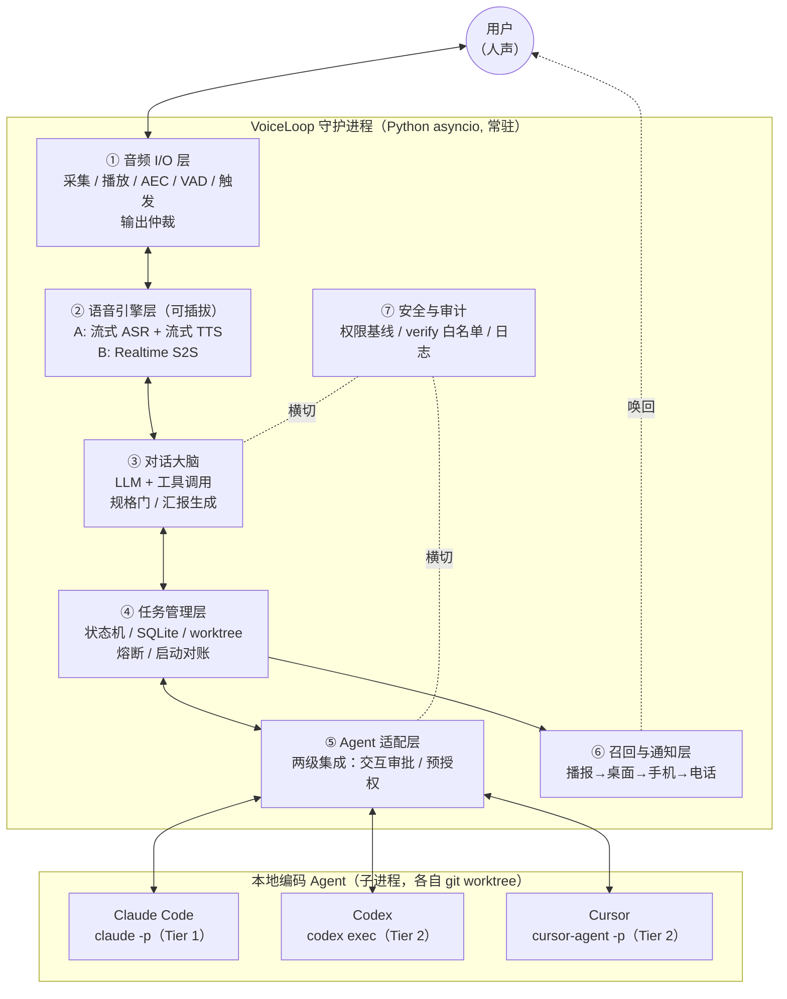
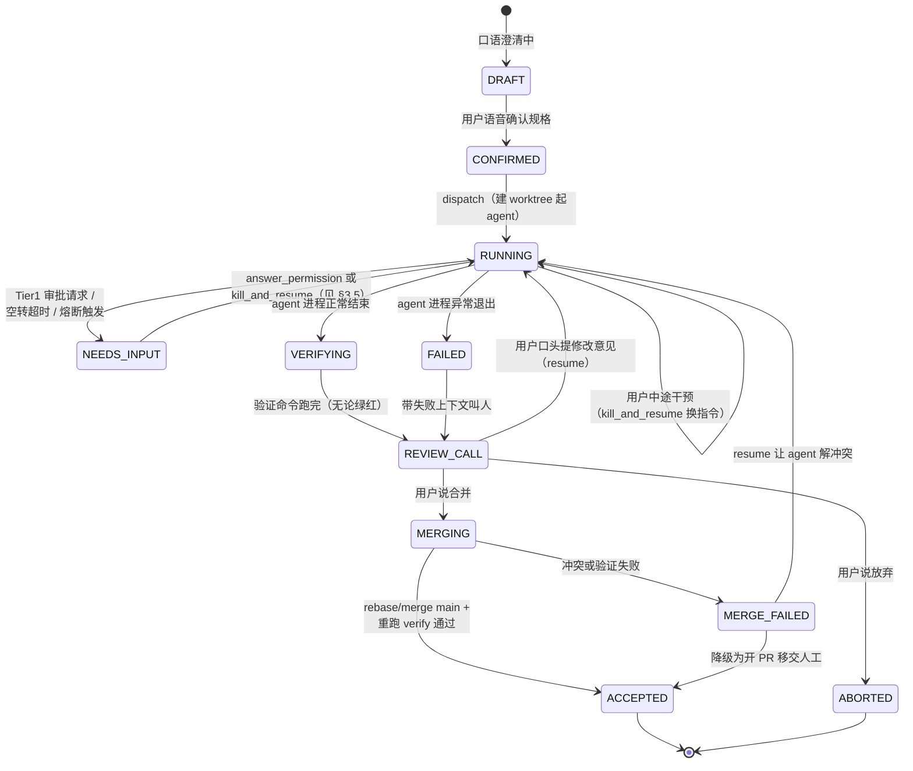
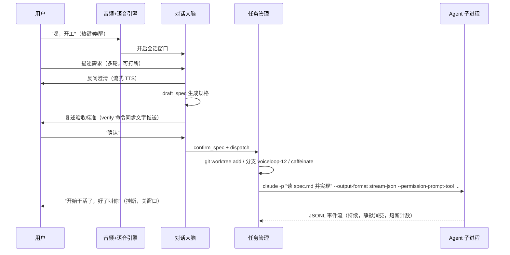
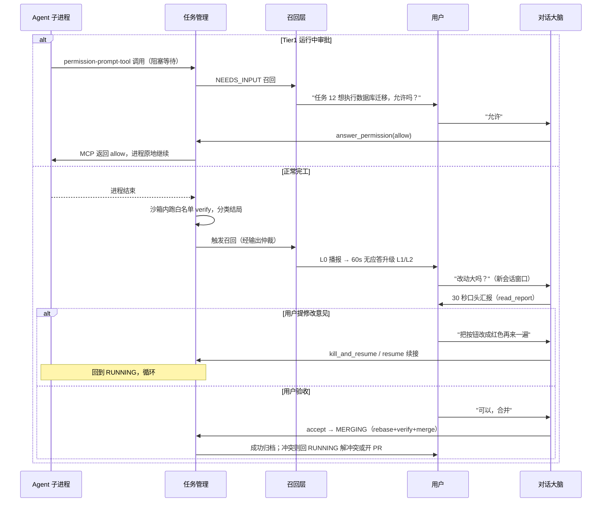

# VoiceLoop —— 用"打电话"的方式指挥本地编码 Agent

> 文档版本：**v2**（v1 草案经独立评审后修订，评审记录见 §9）
> 日期：2026-07-18
> 定位：单机个人工具，运行在开发者自己的 Mac 上

---

## 0. 一句话结论：可行

**这个东西可以做出来，且不依赖任何"未来技术"。** 三块核心能力在 2026 年都已成熟：

1. **双向实时语音对话**（全双工、可打断、低延迟）：既可以用云端语音到语音模型（OpenAI Realtime / Gemini Live），也可以用"流式 ASR + LLM + 流式 TTS"的级联管线达到对话级体验。
2. **本地编码 Agent 的无头编排**：Claude Code（`claude -p`）、Codex（`codex exec`）、Cursor（`cursor-agent -p` / `@cursor/sdk`）三家都正式支持非交互运行、流式 JSON 事件输出、会话续接（resume），可以被一个守护进程统一驱动。**但"运行中交互式审批"只有 Claude Code 有完整的编程化通道**，因此适配层按两级集成设计（见 §3.5）。
3. **完工后主动"叫人"**：本地 TTS 播报 + 系统通知 + 手机推送；远程语音方面，**电话呼入**是 OpenAI Realtime 原生支持的（SIP），电话**外呼**需要 Twilio 侧发起并自建桥接，作为进阶可选项。

真正的工程难点不在"能不能"，而在五处：**回声消除与打断体验**、**把口语需求可靠地变成 agent 可执行的规格**、**检测 agent 何时卡住并把它救回来**、**人不在电脑旁时的召回触达**、**无人值守期间的失控防护（烧钱/危险命令）**。本方案对这五点均给出具体设计与降级路径。

---

## 1. 需求还原与边界

### 1.1 用户旅程（目标体验）

1. 你在房间里说"嘿，开工"（或按下全局热键），系统应答。
2. 你像和同事打电话一样描述需求——可以被它反问、可以随时打断它。
3. 系统口头复述任务规格（目标、验收标准），你说"确认"，通话挂断。
4. 系统在独立的 git worktree 里调度 Claude Code / Codex / Cursor 开发，全程无人值守。
5. 二十分钟后系统主动叫你："任务 12 完成，改了 5 个文件，测试全绿，要听细节吗？"
6. 你口头验收，或者口头提修改意见——系统把意见续接回同一个 agent 会话，继续开发。
7. 你说"可以，合并"，系统合并分支、归档任务。

### 1.2 关键澄清："对话"而不是"语音输入框"

用户要求的是**双向通信**，判定标准是三条，而不是内部实现方式：

- **流式低延迟**：你说完话，P50 ≤1.5 秒、P90 ≤2.5 秒内它开始回应；
- **可打断（barge-in）**：它说话时你可以直接插话，它立即闭嘴听你说；
- **多轮澄清**：它会反问"这个接口要兼容老版本吗"，而不是一次性转写完就完事。

只要做到这三条，内部无论是"语音→文字→语音"级联还是端到端语音模型，体验上都是"对话"。级联的优势是成本低、逻辑可控（工具调用走文本，确定性强）；端到端（S2S）的优势是更自然、延迟更低。本方案把两者做成**可插拔的语音引擎**，默认级联，S2S 作为增强选项。

### 1.3 明确不做（Non-goals）

- 不做通用语音助手 / 闲聊机器人；
- 不做无人值守的全自动多轮迭代——**每一轮迭代必须经过人的语音验收门**，防止 agent 跑偏后越走越远；
- 不做多人会议场景，假设单用户；
- 不做 IDE 插件，这是独立守护进程。

---

## 2. 总体架构



### 2.1 模块职责一览

| # | 模块 | 一句话职责 |
|---|------|-----------|
| ① | 音频 I/O 层 | 麦克风采集、扬声器播放、回声消除、语音活动检测、唤醒/热键触发、打断处理、**输出通道仲裁** |
| ② | 语音引擎层 | 语音⇄文本（或语音⇄语音）的双向流式转换，可插拔两种模式 |
| ③ | 对话大脑 | 一个带工具的 LLM 会话循环：需求澄清、规格生成与确认、调度决策、口头汇报 |
| ④ | 任务管理层 | 任务状态机、持久化、git worktree 隔离、独立验证、**任务熔断、崩溃对账** |
| ⑤ | Agent 适配层 | 把三家 CLI 的差异封装成统一接口；**按"能否交互审批"分两级集成** |
| ⑥ | 召回与通知层 | 完工/卡住时按"就地播报→桌面→手机→电话"梯队叫人 |
| ⑦ | 安全与审计 | agent 权限基线、verify 命令白名单、危险操作二次确认、全量审计日志、麦克风隐私 |

### 2.2 进程形态

- **单机单守护进程**（menubar 图标 + CLI 管理命令），Python 3.12 + asyncio；
- 每个开发任务 = 一个 agent CLI 子进程，stdout 的 JSONL 事件流被适配层实时消费；
- 语音会话是**窗口化**的：从唤醒到挂断算一个窗口，窗口外不建立任何语音连接、不上传任何音频（成本与隐私双重考虑）；
- 有任务 RUNNING 期间持有电源断言（`caffeinate -i` 或 IOKit），防止 App Nap/睡眠挂起子进程；**合盖场景要求插电**（使用约束，见 §8）。

---

## 3. 模块详设

### 3.1 音频 I/O 层

| 子问题 | 方案 | 说明 |
|--------|------|------|
| 采集/播放 | sounddevice（PortAudio），16kHz 采集 / 24kHz 播放 | 若走 Web 前端方案则由浏览器采集，WebSocket 送入守护进程 |
| 回声消除 AEC | 按省力程度排序：**① M0 耳机或按键说话（无需 AEC）→ ② M1 本地 Web 音频前端（推荐）**：menubar WKWebView 或 localhost 浏览器页，用 `getUserMedia({echoCancellation:true})` 借浏览器工业级 AEC，音频经 WebSocket 进守护进程，顺带免费获得状态可视化 UI → ③ 原生 VoiceProcessingIO：需独立 Swift helper（**PortAudio/sounddevice 链路用不上 VPIO**，且外置 USB 麦兼容性差），失败自动降级 → ④ webrtc-audio-processing 软件 AEC：需手工对齐远端参考信号与采集流延迟，深坑，最后选项 | **扬声器外放模式必须有 AEC**，否则 TTS 声音被麦克风收回导致自我打断；做不到就强制按键说话 |
| 语音活动检测 VAD | Silero VAD（本地、轻量、多语言） | 判定"用户说完了"（尾部静音 300–500ms） |
| 会话触发 | M0：全局热键按住说话（PTT）；M1：会话窗口内免手 VAD；M2：唤醒词（Porcupine 自定义中文词 / openWakeWord）+ menubar 按钮兜底 | 唤醒词有误触发与授权成本，放最后 |
| 打断 barge-in | TTS 播放中检测到用户持续语音 ≥300ms → 立即停播 → 转录用户的话 → 大脑决定丢弃剩余播报还是继续 | 级联模式自己实现；S2S 模式由 Realtime API 原生处理 |
| **输出仲裁** | 全局单一音频输出协调器：语音会话进行中，新到的召回播报**不插播**，排队到会话收尾时带一句"另外，任务 A 也好了"；检测到麦克风/音频设备被其他 App 占用（CoreAudio 可查，典型场景：Zoom 开会）时**跳过 L0 播报**直接走桌面/手机通知 | 修复 v1 遗漏：完工播报与进行中对话/会议抢扬声器 |

### 3.2 语音引擎层（可插拔双模式）

**模式 A：级联管线（默认）**

```
麦克风 → VAD → 流式 ASR ──文本──→ 对话大脑（LLM+工具） ──文本──→ 流式 TTS → 扬声器
```

- 全链路流式：ASR 边说边出部分转写；LLM 流式出 token；TTS 按句切分、句级流式合成，首句先播。
- **延迟预算**（统一口径：P50 ≤1.5s、P90 ≤2.5s，从"用户说完"到"开始出声"）：VAD 尾静音判定 300–500ms + ASR final 200–400ms + LLM 首句 300–800ms + TTS 首包 200–500ms。
- 中文选型：
  - ASR（流式）：云——火山引擎流式识别 / 阿里 Paraformer 实时版 / OpenAI gpt-4o-transcribe；本地——FunASR Paraformer-streaming、sherpa-onnx。云端 ASR 建议配**热词表**（项目名、类名、"worktree"这类术语）。
  - TTS（流式）：云——火山 / Minimax / OpenAI TTS；本地兜底——**piper / kokoro 级轻量模型，应急可用 macOS 自带 `say`（AVSpeechSynthesizer）**；CosyVoice 2 音质好但在无 CUDA 的 Apple Silicon 上首包延迟达不到指标，标注为"需 GPU 机器"。
- 优点：成本低一个数量级、工具调用走文本确定性强、每一环可独立替换/本地化。

**模式 B：Speech-to-Speech（增强选项）**

- OpenAI Realtime（WebRTC/WebSocket，原生支持工具调用、打断、SIP 呼入），或 Gemini Live。
- 只在会话窗口内建立连接，挂断即关闭。注意单会话上限 60 分钟（对"对话窗口"够用，超时自动重连并携带上下文摘要）。
- 定位：对话体验的天花板，但成本高、对话行为偏黑盒，作为可选配置项。

**两种模式对上层暴露同一接口**：`say(text_or_audio)`, `on_user_utterance(callback)`, `interrupt()`，大脑层不感知引擎差异。

### 3.3 对话大脑（Dialogue Brain）

一个系统提示词固定为"开发调度员"角色的 LLM 会话循环（任选 function-calling 强的模型），持有以下工具：

| 工具 | 作用 |
|------|------|
| `draft_spec(brief)` | 把多轮口语澄清汇总成结构化规格草稿 |
| `confirm_spec(spec_id)` | 规格门放行（前置条件：已向用户口头复述且用户明确说"确认"） |
| `dispatch(spec_id, agent?)` | 派发任务：建 worktree、起 agent 子进程 |
| `list_tasks()` / `get_status(task_id)` | 查任务与最近事件摘要（用户随时可以唤醒来问进度） |
| `answer_permission(task_id, allow/deny)` | 答复 Tier 1 agent 的运行中审批请求（见 §3.5） |
| `intervene(task_id, text)` | 用户中途改需求/提意见：按 §3.5 恢复语义选择 kill_and_resume |
| `run_verify(task_id)` | 执行**白名单内的**验证命令（见下） |
| `read_report(task_id)` | 把事件流+diff 加工成 30 秒口头汇报稿 |
| `accept(task_id)` / `abort(task_id)` | 验收合并 / 终止任务 |
| `notify(channel, msg)` | 主动触发通知梯队 |

**规格门（Spec Gate）——本方案最重要的机制之一。** 口语是有损信道，绝不把 ASR 转写直接扔给编码 agent。流程：

1. 多轮澄清后，大脑生成 `spec.md`：背景 / 目标 / **验收标准（≤3 条，可验证）** / 约束 / 涉及路径 / 验证命令 / 指定 agent；
2. 大脑**只口头复述验收标准**（不是全文，全文太长听不进去）；
3. 用户明确说"确认"才允许 `dispatch`；说"不对"则回到澄清；
4. `spec.md` 落盘，agent 的首条 prompt 就是"阅读 spec.md 并实现之"——**agent 读的是文件，不是口语转写**。

**verify 命令白名单（修复 v1 高风险项）**：agent 全程被沙箱管着，但 v1 里编排器"独立执行 verify"是以完整用户权限跑一条 LLM 从口语生成的任意命令——这是一条不设防的命令注入通道（ASR 误听或 LLM 幻觉即可注入危险命令）。v2 规定：verify 只能从**项目配置中预登记的命令模板**里选（如 `package.json` scripts、justfile 目标、`voiceloop.toml` 里登记的条目），LLM 只能选模板、不能自由拼装命令；执行时套用与 agent 同级的沙箱；规格门确认时把 verify 命令原文以**文字**形式推送到通知渠道留痕。

**汇报生成**：完工汇报只说四件事——改了什么（文件数+要点）、验证结果、遗留问题、需要用户决定什么。"读 diff"不逐行朗读，只读统计与关键点，全文通过桌面通知/手机推送附链接送达。

**会话窗口策略**：唤醒开窗，用户说"挂了/没事了"或静默 60 秒关窗。窗口外零音频上传，只有本地热键/唤醒词侦听在跑。

### 3.4 任务管理层



- **存储**：SQLite（tasks / sessions / events / audit 四张表）+ 每任务产物目录 `~/.voiceloop/tasks/<id>/`（`spec.md`、`events.jsonl`、`report.md`、`diff.patch`、语音转写）。
- **隔离**：每任务 `git worktree add`，分支名 `voiceloop/<id>`。同一仓库多任务并行互不踩踏；验收后走 MERGING（先 rebase/merge main、重跑 verify，再合并——**合并冲突是常态而非异常**，失败有明确去处）。Cursor CLI 有内建 `--worktree`，Claude/Codex 由编排器统一创建。
- **独立验证**：agent 说"做完了"不算数。编排器在 worktree 里跑白名单内的 `spec.verify` 命令（带超时、沙箱），结果参与结局分类：`success / tests_failed / agent_failed / needs_input`。
- **任务熔断（修复 v1 遗漏）**："15 分钟无事件"只能抓住挂死，抓不住"活跃地兜圈烧钱"（反复改-测-改、反复重试失败命令，几小时不停）。每任务三道熔断：**墙钟上限**（默认 45 分钟）、**回合数上限**（Claude Code 直接用 `--max-turns`，其余按事件计数）、可选 **token/成本上限**。触发 → cancel → 带上下文进 REVIEW_CALL 叫人裁决。
- **启动对账（修复 v1 遗漏）**：守护进程崩溃/升级重启会杀死或孤儿化子进程。启动时扫描 DB：状态为 RUNNING 但 PID 不存在的任务 → 标记 `interrupted` → 用各家 resume 机制恢复，恢复不了则降级叫人。
- **回访排队**：多个任务同时到达 REVIEW_CALL 时排队叫人，一次通话只谈一个任务，避免口头上下文串台。

### 3.5 Agent 适配层

统一接口（Python Protocol）：

```python
class AgentDriver(Protocol):
    async def start(self, task: Task) -> SessionRef: ...
    async def resume(self, ref: SessionRef, message: str) -> None: ...  # 进程已退出后续接
    def events(self, ref: SessionRef) -> AsyncIterator[AgentEvent]: ...
    async def cancel(self, ref: SessionRef) -> None: ...
    capabilities: AgentCapabilities  # 声明式：能否交互审批、如何熔断……
```

**两级集成（v2 核心修订）**。v1 假设"三家都有可归一化的 permission_request 事件"，评审证伪：**headless 模式下的实际行为三家截然不同**——Claude Code `-p` 对未授权操作默认自动拒绝后继续（不产生可等待的事件），唯一能"阻塞等人"的编程化通道是 `--permission-prompt-tool`（MCP 工具审批）或 Agent SDK 的 `canUseTool` 回调；`codex exec` 非交互下审批策略实际退化为 never，若强行出现审批请求会挂死且**无通道可应答**；Cursor headless 官方路径就是预授权（`--force`/`--trust`/permissions 配置），无文档化的审批事件流。因此：

| | **Tier 1：交互式审批** | **Tier 2：预授权 + 事后恢复** |
|---|---|---|
| 适用 | Claude Code | Codex、Cursor |
| 权限策略 | 保守基线 + 运行中动态审批：编排器内置本地 MCP server 提供 `approve` 工具，`claude -p --permission-prompt-tool` 指向它；agent 需要越权操作时**阻塞在工具调用上**→ 转 NEEDS_INPUT 叫人 → 用户口头"允许/拒绝" → 返回结果，进程原地继续 | 运行前一次性把沙箱内权限配足，运行中**不指望任何交互审批**；越界操作直接失败，由 agent 自行绕行或任务失败 |
| 卡住恢复 | answer_permission（进程不退出） | **kill_and_resume**：SIGTERM → `resume <session_id>` + 补充指令（各家 resume 均保留完整上下文） |
| 熔断 | `--max-turns` + 墙钟 | 事件计数 + 墙钟 |

三家命令速查（已联网核实，2026-07；参数以本机 `--help` 为准，适配层集中吸收版本漂移）：

| 能力 | Claude Code（Tier 1） | Codex CLI（Tier 2） | Cursor CLI / SDK（Tier 2） |
|------|-------------|-----------|------------------|
| 无头运行 | `claude -p "<prompt>"` | `codex exec "<prompt>"` | `cursor-agent -p "<prompt>"` 或 SDK `Agent.prompt` |
| 流式事件 | `--output-format stream-json`（需配 `--verbose`） | `--json`（JSONL：`thread.started` / `turn.*` / `item.*` / `error`） | `--output-format stream-json`（可加 `--stream-partial-output`） |
| 结构化结果 | `--output-format json` | `--output-schema <schema>` + `-o <file>` | `--output-format json` |
| 续接会话 | `--resume <session_id>` | `codex exec resume <session_id>`（或 `--last`） | `--resume <chat_id>` / SDK `Agent.resume` |
| 预建会话 ID | 首轮结果里取 session_id | 首轮事件里取 thread id | `cursor-agent create-chat` 先拿 chat_id |
| 权限/沙箱 | `--permission-mode` + `--allowedTools` + `--permission-prompt-tool`（MCP 编程化审批）+ hooks | `--sandbox read-only\|workspace-write`（审批固定 never，见上） | `--sandbox enabled` + cli-config permissions；`--force`/`--trust` 仅容器内 |
| 熔断辅助 | `--max-turns N` | 事件计数 | 事件计数 |
| worktree | 编排器创建 | 编排器创建 | 内建 `-w/--worktree` |
| 备选 SDK | Claude Agent SDK（`canUseTool` 回调审批） | `@openai/codex-sdk`（TS）；**`codex app-server`（JSON-RPC，带审批回调）——未来若要给 Codex 做交互审批，走这里而不是 exec** | `@cursor/sdk` / `cursor-sdk`（`Agent.create/send/resume`，事件与错误分类完善） |

**恢复语义三种**（状态机 §3.4 联动，v2 明确区分——v1 笼统写"resume"是错的，因为运行中的子进程无法被注入消息）：

1. `answer_permission`：仅 Tier 1。MCP 审批工具返回 allow/deny，进程不退出，原地继续；
2. `kill_and_resume`：通用。SIGTERM（默认等当前事件边界，超时强杀）→ `resume` 带用户新指令续接。用于：Tier 2 卡住/空转、用户中途改需求、熔断后用户说"继续但换个思路"；
3. `cancel`：放弃，worktree 保留供事后检查。

**NEEDS_INPUT 检测信号（按家如实标注，不再假装通用）**：

- Claude Code：`permission-prompt-tool` 被调用（强信号，可交互解除）+ `Notification` hook 落事件文件（辅助）；
- Codex / Cursor：空转超时（默认 15 分钟无事件）+ 进程退出但结果不完整 → 一律走 kill_and_resume 或叫人；
- 全家通用：任务熔断三上限（§3.4）。

**Agent 路由**：`spec.md` 里有 `agent:` 字段；用户点名则用点名的；不点名默认 Claude Code（Tier 1 闭环最完整）。多 agent 是用户核心需求，保留，但按里程碑分期接入（§6）。

### 3.6 召回与通知层（Escalation Ladder）

| 级别 | 通道 | 触达前提 | 说明 |
|------|------|----------|------|
| L0 | 扬声器 chime + TTS 播报 | 人在电脑附近 | "任务 12 完成，测试全绿，方便说话吗？"；**受输出仲裁管制**（§3.1）：会话中不插播、检测到会议软件占用音频设备时自动跳过 |
| L1 | macOS 通知中心 | 人在看屏幕 | 60 秒无语音应答后升级 |
| L2 | 手机推送（ntfy / Telegram Bot） | 人不在家/在路上 | 附文字摘要；**用户可以直接回文字**，文字与语音驱动同一个大脑 |
| L3（可选，M2+） | 远程语音 | 兜底 | 见下，呼入为主 |

**L3 远程语音的两条路（v2 修正——v1 "OpenAI Realtime SIP + Twilio 外呼"的说法把方向搞反了）**：

- **呼入为主（推荐）**：OpenAI Realtime 的 SIP 支持原生就是**呼入**模型（`realtime.call.incoming` webhook → accept → sideband WebSocket 接同一个大脑）。做法：L2 推送写明"任务完成，可回拨 +86-xxx"，用户方便时**打给系统**。基础设施只需一个 Twilio 号码 + SIP trunk 指向 OpenAI + 一个可公网访问的 webhook（可用轻量云函数中转，Mac 本机无需暴露公网）。
- **外呼（进阶可选）**：官方不提供 Realtime 外呼端点，必须由 Twilio REST API 发起呼叫 + Media Streams WebSocket 自建音频桥（意味着常驻公网 WSS 端点/隧道）。成本与运维负担明显更高，仅在"必须秒级叫到人"的场景才值得。
- **远程通道安全**：电话/推送回复默认**只读**（听汇报、看摘要）；要通过远程通道下发指令（如"继续改"）必须口述 PIN 或在推送里点确认按钮——防止别人拿起你的电话指挥你的 agent。

召回策略可配置：完成后 5 分钟未应答逐级升级；夜间免打扰窗口内只推送不出声，早晨集中汇报。

### 3.7 安全与隐私

| 维度 | 基线 |
|------|------|
| agent 权限 | Codex：`--sandbox workspace-write`（默认禁网）；Claude Code：`--permission-mode acceptEdits` + `--allowedTools` 白名单 + `--permission-prompt-tool` 动态审批；Cursor：`--sandbox enabled` + permissions 配置。**`--yolo` / `--force` / `--dangerously-skip-permissions` 一律禁止在裸机使用**，只允许出现在 devcontainer 内 |
| verify 命令 | 只能从项目预登记的白名单模板中选择，沙箱内执行，规格确认时文字留痕（§3.3） |
| 工作区 | 只允许操作配置过的项目目录白名单；一切改动发生在 worktree 分支，主分支永远干净 |
| 危险操作 | `push --force`、删除分支、生产部署等：要求用户**复述指定短语**（"确认强推"）+ 同时发一条通知留痕；ASR 误识别兜底是手机推送上的确认按钮 |
| 失控防护 | 任务三熔断（墙钟/回合/成本，§3.4），超限必叫人 |
| 审计 | 所有语音指令转写、spec、审批决定、agent 命令、diff 全量落 `audit.jsonl` |
| 麦克风隐私 | 会话窗口外音频不出本机（热键模式下甚至不采集）；menubar 常驻录音指示；一键硬静音 |

---

## 4. 核心时序

### 4.1 下发段：从一句话到 agent 开跑



### 4.2 回访段：完工/卡住之后



---

## 5. 技术选型汇总

| 层 | 选型 | 备注 |
|----|------|------|
| 语言/运行时 | Python 3.12 + asyncio，单守护进程 | 语音生态最全；agent 全部走子进程 JSONL，无语言绑定 |
| 音频采集 | M0：sounddevice + 耳机/PTT；M1：本地 Web 音频前端（WKWebView + getUserMedia，浏览器 AEC） | 原生 VPIO 需 Swift helper，列为备选 |
| VAD | Silero VAD | 本地推理，毫秒级 |
| 语音管线 | M0 自研薄层；若打断/AEC 打磨成本超预期 → 迁移 Pipecat 或 LiveKit Agents（自带打断、多供应商适配） | 自研薄层依赖少、可控 |
| ASR / TTS | 见 §3.2 中文选型 | 全部走可替换 Provider 接口 |
| 大脑 LLM | 任意强 function-calling 模型，流式 | 与语音供应商解耦 |
| 存储 | SQLite + 文件产物目录 | 单机够用，无需服务 |
| 通知 | terminal-notifier / ntfy / Telegram Bot | 全部现成 |
| 远程语音（可选） | 呼入：Twilio SIP trunk → OpenAI Realtime SIP + 云函数 webhook；外呼（进阶）：Twilio REST + Media Streams 自建桥 | 仅 M2 |
| 热键 | pynput / skhd | M0 触发方式 |
| 唤醒词 | Porcupine（自定义中文，注意商用授权）或 openWakeWord | 仅 M2 |
| 电源 | caffeinate / IOKit 断言 | 任务运行期防睡眠 |

---

## 6. 里程碑

| 阶段 | 内容 | 验收标准 |
|------|------|----------|
| **M0（1–2 周）打通闭环** | 热键 PTT + 级联语音 + **仅 Claude Code**（Tier 1 审批闭环）+ 规格门 + worktree + 三熔断 + 启动对账 + 完工就地播报/桌面通知 | **全程不碰键盘**完成一个真实小需求：口述→确认→等待→（可能答复一次审批）→听汇报→口头验收合并 |
| **M1（+2–4 周）体验补全** | 免手 VAD + Web 前端 AEC 外放打断 + ntfy 手机推送 + 多任务并行 worktree + MERGING 冲突处理 + **Codex、Cursor 以 Tier 2 模式接入** | 外放扬声器下能自然对话打断；人在楼下也能被叫到；三家 agent 可按 spec 指派 |
| **M2（按需）增强** | 唤醒词、Realtime S2S 模式、远程语音（呼入优先，外呼可选）、Codex app-server 交互审批评估、路由策略 | 出门在外可通过回拨电话完成一轮验收 |

---

## 7. 成本与延迟量级（实施时需按当时价目重核）

- **级联模式**：流式 ASR ≈ $0.01/分钟级，流式 TTS ≈ $0.02/分钟级，大脑 LLM 对话 token 相对编码 agent 可忽略。按每天 30–60 分钟对话量，**每月 $20–50 量级**；ASR/TTS 换本地模型可降到零边际成本。
- **S2S 模式**：Realtime 类 API 约 $0.1–0.5/分钟量级，同样对话量每月贵一个数量级——这是它只作为可选项的主因。
- **大头永远是编码 agent 自身的 token 消耗**，这与不用语音时相同，不计入本工具增量成本；但**三熔断把无人值守期间的失控上限变成了可配置常数**（v1 没有这层保护）。
- 延迟：级联端到端 P50 ≤1.5s / P90 ≤2.5s（见 §3.2 预算分解），S2S 可到 1s 内。

---

## 8. 遗留风险与开放问题

1. **中文口语里的代码术语**（类名、路径、英文缩写）ASR 错误率高 → 热词表 + 规格门复述兜底 + 汇报时关键标识符同步推送文字。
2. **CLI 参数与事件格式随版本漂移**（三家迭代都很快）→ 适配层集中封装 + 锁版本 + 每日冒烟测试。
3. **Web 前端 AEC 路径未实测**（WKWebView 的 getUserMedia 权限与 AEC 效果需验证）→ M0 用耳机/PTT 绕开，M1 专项验证，失败则退回耳机模式。
4. **Tier 2 agent 的 kill_and_resume 恢复质量**依赖各家 resume 对上下文的保真度，被强杀瞬间的半成品状态可能让续接后的 agent 困惑 → resume 指令模板里强制先"git status + 自查当前状态"再继续。
5. **合盖睡眠**：caffeinate 只在插电时可靠，电池+合盖会挂起子进程 → 文档化使用约束："跑任务时插电，或开盖锁屏"。
6. **长任务（>1h）的心跳频率**：多久播报一次进度不算打扰？→ 默认静默、仅按里程碑推送文字，做成可配置。
7. **唤醒词误触发**（电视、家人说话）→ M2 再做，且保留热键/按钮兜底。
8. **verify 白名单覆盖不了临时验证需求**（用户口头说"顺便帮我看看构建时间"）→ 明确拒绝并引导：临时命令属于 agent 沙箱内的活，不走编排器通道。

---

## 9. 评审记录（v1 → v2）

### 9.1 评审方法

1. v1 成稿后，交给一个**独立评审代理**（未参与设计，带联网核实能力）做对抗性审查，要求逐条给出证据；
2. 设计者对 12 条评审意见逐一核对事实、裁决采纳/部分采纳，落实为 v2 修订；
3. 关键 CLI 能力（`claude -p` 权限行为、`codex exec` 审批与 resume、`cursor-agent` 参数、OpenAI Realtime SIP 方向性、Cursor SDK 接口）另行联网交叉核实。

### 9.2 评审发现与处置（按严重程度排序）

| # | 位置 | 类型 | 问题（摘要） | 处置 |
|---|------|------|------------|------|
| 1 | §3.5 | **技术事实错误（核心）** | v1 假设"三家都有可归一化的 permission_request 事件，可等人解除"。实际：Claude `-p` 未授权操作**自动拒绝不产生可等待事件**（编程化审批只有 `--permission-prompt-tool`/SDK `canUseTool`）；`codex exec` 非交互下审批退化为 never，强行出现审批会**挂死且无通道应答**；Cursor headless 官方路径就是预授权，无审批事件流 | **采纳，重写 §3.5**：两级集成（Tier 1 交互审批=Claude；Tier 2 预授权+事后恢复=Codex/Cursor），删除"三家通用"表述 |
| 2 | §3.4 | **技术事实错误** | v1 状态机把 NEEDS_INPUT→RUNNING 笼统标为"resume"，但**运行中的子进程无法被注入消息**；且缺"用户中途改需求"转移 | **采纳**：拆分三种恢复语义（answer_permission / kill_and_resume / cancel），状态机补 RUNNING 自环（中途干预）与 kill 时机说明 |
| 3 | §3.6 L3 | **技术事实错误** | v1 称"OpenAI Realtime SIP + Twilio 号码"可外呼。官方 SIP 只定义**呼入**流程，外呼须 Twilio 发起 + 自建媒体桥 + 公网端点，轻描淡写 | **采纳，重写 L3**：改为"呼入为主（原生支持、基础设施轻）+ 外呼进阶可选（如实标注成本）" |
| 4 | §3.1 | **无法实现（按 v1 链路）** | v1 的"sounddevice + VoiceProcessingIO"组合不成立：PortAudio 用不上 VPIO；VPIO 对外置麦兼容性差；webrtc-apm 的参考信号对齐是深坑 | **采纳**：推荐路径改为本地 Web 音频前端借浏览器工业级 AEC；VPIO 降为"需 Swift helper"备选；webrtc-apm 列最后 |
| 5 | §3.4 | **遗漏（必然发生）** | 守护进程崩溃/重启会孤儿化 RUNNING 任务，无对账；合盖睡眠挂起子进程恰是"人走开等叫"的高发场景 | **采纳**：新增启动对账机制 + caffeinate 电源断言 + 使用约束写入 §8 |
| 6 | §3.3 | **高风险** | v1 的 verify 命令由 LLM 从口语生成、以完整用户权限裸跑，是绕过一切沙箱的命令注入通道 | **采纳**：verify 白名单模板化 + 沙箱执行 + 确认时文字留痕 |
| 7 | §3.4 | **遗漏** | 只有"15 分钟无事件"护栏，抓不住活跃兜圈烧钱（几小时改-测-改） | **采纳**：任务三熔断（墙钟 45min / 回合数 `--max-turns` / 成本上限），超限叫人 |
| 8 | §3.4 | **遗漏** | "验收后合并"无失败分支；并行任务 + main 前进使冲突成为常态 | **采纳**：新增 MERGING / MERGE_FAILED 状态：先 rebase+重跑 verify 再合并，失败可 resume 解冲突或降级开 PR |
| 9 | §3.5/§6 | **过度设计** | 评审建议 M0/M1 只做 Claude Code，砍掉多 agent 归一化与路由表 | **部分采纳**：多 agent 是用户的原始核心需求，不砍；但接受分期——M0 仅 Claude Code，M1 以 Tier 2 模式接入 Codex/Cursor（不再强行归一审批模型），路由表简化为"用户点名 + 默认 Claude" |
| 10 | §1.2/§3.2 | **不合理（口径矛盾）** | v1 §1.2 承诺"约 1 秒"与 §3.2 预算 1.0–2.2s 自相矛盾；CosyVoice 2 在 Apple Silicon 上达不到首包指标 | **采纳**：全文统一 P50 ≤1.5s / P90 ≤2.5s；本地 TTS 兜底改 piper/kokoro/`say`，CosyVoice 标注需 GPU |
| 11 | §3.1/§3.6 | **遗漏** | 音频输出无仲裁：完工播报会打断进行中的语音会话，或打进用户的 Zoom 会议 | **采纳**：新增输出仲裁器——会话中召回入队尾播、检测音频设备被会议软件占用时跳过 L0 |
| 12 | §3.5 | **技术事实错误（轻微）** | v1 写 Codex 无备选 SDK。实际有 `@openai/codex-sdk`（TS）与 `codex app-server`（JSON-RPC 带审批回调，恰是未来解决 Codex 交互审批的正道） | **采纳**：补入能力表与 M2 计划 |

### 9.3 评审总评（引自独立评审）

> 设计整体可行且成熟度高于同类草案——分层、规格门、worktree 隔离、召回梯队、成本估算方向都对，M0 范围如实可达。最大的两个风险：一是把"检测并交互式解除 agent 卡住"当成三家通用能力，实际只有 Claude Code 有完整编程化审批通道（已按两级集成重写）；二是音频外放 AEC 按 v1 链路走不通（已改走 Web 前端 AEC / 耳机 / PTT 路径）。

### 9.4 v1 → v2 关键变更清单

1. Agent 适配层从"统一审批事件"重构为**两级集成模型**（Tier 1 / Tier 2），恢复语义拆分为 answer_permission / kill_and_resume / cancel；
2. AEC 技术路线更换：**本地 Web 音频前端（浏览器 AEC）成为外放推荐路径**，原生 VPIO 降级为备选；
3. 电话召回方向修正：**呼入为主，外呼为进阶可选**；
4. 新增五道防护：任务三熔断、启动对账、电源断言、verify 白名单沙箱化、音频输出仲裁；
5. 状态机补全：用户中途干预自环、MERGING/MERGE_FAILED 分支；
6. 延迟口径统一（P50 1.5s / P90 2.5s）、本地 TTS 兜底选型更换；
7. 里程碑重排：M0 单 agent（Claude Code）先闭环，M1 再接 Codex/Cursor（Tier 2），M2 评估 codex app-server。
