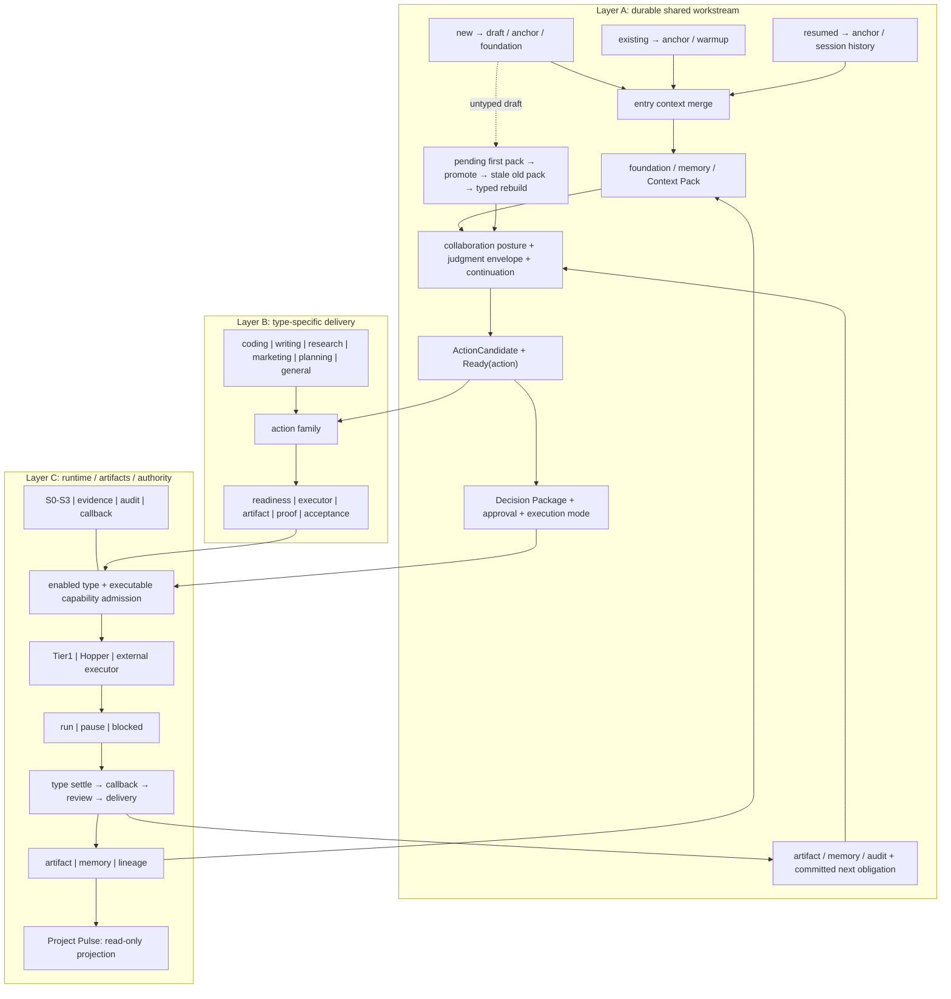

# SayDo 全业务流与协作模型审计

## 0. 执行摘要与最终判定

本报告的最终判定如下。

1. [canonical] SayDo 不是单一“采访 → readiness → 执行”工作流，而是“共享产品主链 + 类型化交付合同”。正式业务类型有 `coding / writing / research / marketing / planning / general`，`pending` 是尚未定型的生命周期状态，不是第七种执行器。类型枚举与不可变语义见 `docs/09-data-contracts.md:42-57`，实现枚举见 `packages/contracts/src/types/project.ts:7-29`。
2. [implemented][gap] 当前有可闭环主体的类型只有 `coding` 与窄版 `writing`；两者都借用 git worktree、Tier1、review 与 S3 merge。`research / marketing / planning / general` 没有受支持的 settle 合同。它们产品默认关闭；但若被误加入 `enabled_project_types`，现有 type gate 仍可能先创建 worktree、运行通用 agent，直到 settle 才以 `project_type_unexecutable` 阻断。这是 pre-dispatch capability gate 缺失，不应简称为“executor 已 fail closed”。证据见 `packages/daemon/src/tier1/typeGate.ts:14-32`、`packages/daemon/src/tier1/executor.ts:510-565,691-757,904-919`。
3. [canonical][runtime] 产品缺省只启用 `coding`，当前本机有效配置启用了 `coding + writing`。前者见 `docs/09-data-contracts.md:1044-1049`，后者见 `HANDOFF.md:28,50` 与只读检查的 `~/.saydo/config.toml:71`。二者不能互相替代。
4. [canonical][gap] `report` 当前是 Artifact，不是 ProjectType。真正缺的不是一个同名顶层类型，而是 `research` 内部的 action family、分阶段 readiness、来源与反证合同、research settle、report settle、验收和跨项目 lineage。Artifact 枚举见 `packages/contracts/src/types/artifact.ts:8-17`，research 与 writing 的产品边界见 `docs/02-product-definition.md:74-80,88-98`。
5. [canonical][gap] 共享主链已经覆盖入口、project anchor、foundation、readiness、Decision Package、批准、执行、settle、回叫、验收与沉淀；但现有 Brain 仍把对话默认压向任务化，仓内也没有 durable workstream、committed next obligation、continuation owner 或 judgment envelope。证据见 `docs/02-product-definition.md:17-35,47-86`、`packages/daemon/src/brain/instructions.ts:4-18,42-47` 与 `packages/daemon/src/storage/ddl.ts:8-198`。
6. [canonical][implemented][gap] Tier1 与 Hopper 在架构上是双路径，但当前 live dispatch 固定创建 `route: "tier1"`；bridge/Hopper 合同存在，不等于生产 dispatcher 已能按类型或动作选择正确 executor。证据见 `docs/03-architecture.md:114-119`、`packages/daemon/src/brain/liveTools.ts:327-343` 与 `packages/daemon/src/bridge/`。
7. [proposal] OctoAgent 的协作路由正确识别了 direct / explore / review / delegate、证据与 authority 分离、推进主动权不等于等待对象；但它只是跨类型协作政策层。若把五层竖排读成串行 pipeline，或把 router 当作 project type、action contract 和交付层的替代品，就会误导实施。
8. [history] 旧 `research/business-flows.md/.html` 的八图覆盖了新 SVG 遗漏的执行、验收、记忆、回叫与部署面；但其中 `VoiceLoop`、L0-L3、旧任务状态和“非 coding 不 merge”已被后续合同改写；“不要下指令”的绝对表述也与 Quick/direct 路径形成张力。旧图不能原样复活，而“明确指令应成为一等路径”仍需 owner 将外部提案提升为 canonical。证据见 `research/business-flows.md:1-12,56-122,126-182,236-279`。
9. [implemented][gap] 当前 Dashboard、Tasks、Artifacts、Memory 可以提供任务态、待处理项、产物版本和记忆状态，却不能可靠投影完整 Project Pulse。六行中“需要你”最接近可用，“推进责任”完全没有权威数据源；不能以模型总结补齐这些事实缺口。
10. [proposal] 下一版内部图应拆成三层：A 为 durable shared workstream，B 为 project type + action family + type-specific delivery，C 为 runtime / artifacts / authority。公众文章图应另画，只讲可动态切换的协作体验，不承担内部合同总览。

## 1. 研究坐标、方法与证据层级

### 1.1 冻结坐标

第一次冻结发生于 `2026-07-30 23:51:29 +0800`，写作前复核于 `2026-07-31 00:03:47 +0800`。仓库兼容路径 `SayDo` 解析到实际目录 `saydo`。

```text
cwd: ~/WorkSpace/saydo
current branch: codex/merge-voice-coding-20260729
HEAD SHA: 1a26b0786a952f8411ed008aa444208d6d6ff945
audit timestamp: 2026-07-30 23:51:29 +0800
target at freeze: missing
```

冻结时 `git status --short` 如下；这些改动均先于本报告，是其他会话的迁移与运行时工作，本审计只读理解：

```text
 M docs/02-product-definition.md
 M docs/09-data-contracts.md
 M docs/10-voice-ux-spec.md
 M docs/11-ui-spec.md
 M docs/modules/a-dialogue.md
 M e2e/owner-sessions/session-1.md
 M packages/console/package.json
 M packages/console/src/App.tsx
 M packages/console/src/shell/VoiceContext.tsx
 M packages/console/src/voice/useVoiceChannel.ts
 M packages/contracts/src/ids.ts
 M packages/contracts/src/types/pipeline.ts
 M packages/contracts/src/types/project.ts
 M packages/daemon/src/api/actions.ts
 M packages/daemon/src/api/fixture.ts
 M packages/daemon/src/approvals/presentation.ts
 M packages/daemon/src/backup/cli.ts
 M packages/daemon/src/backup/snapshot.ts
 M packages/daemon/src/brain/dialogLoop.ts
 M packages/daemon/src/brain/golden.ts
 M packages/daemon/src/brain/instructions.ts
 M packages/daemon/src/brain/liveTools.ts
 M packages/daemon/src/brain/tools.ts
 M packages/daemon/src/index.ts
 M packages/daemon/src/launchd/cli.ts
 M packages/daemon/src/launchd/plist.ts
 M packages/daemon/src/live/confirm.ts
 M packages/daemon/src/live/dialog.ts
 M packages/daemon/src/live/pack.ts
 M packages/daemon/src/live/voiceSessions.ts
 M packages/daemon/src/memory/foundationOps.ts
 M packages/daemon/src/net/pairUrl.ts
 M packages/daemon/src/projects/lifecycle.ts
 M packages/daemon/src/session/manager.ts
 M packages/daemon/src/storage/dao/projects.ts
 M packages/daemon/src/storage/ddl.ts
 M packages/daemon/src/tier1/approvalFlow.ts
 M packages/daemon/src/tier1/executor.ts
 M packages/daemon/src/tier1/s3Tools.ts
 M packages/daemon/src/voice/hub.ts
 M packages/daemon/test/approvals-service.test.ts
 M packages/daemon/test/artifacts-controls.test.ts
 M packages/daemon/test/backup.test.ts
 M packages/daemon/test/config-project-overrides.test.ts
 M packages/daemon/test/console-actions.test.ts
 M packages/daemon/test/launchd-plist.test.ts
 M packages/daemon/test/live-voice-sessions.test.ts
 M packages/daemon/test/live-wiring.e2e.test.ts
 M packages/daemon/test/memory-growth.test.ts
 M packages/daemon/test/park-scheduler.test.ts
 M packages/daemon/test/policy-approvals.test.ts
 M packages/daemon/test/proposed-ttl.test.ts
 M packages/daemon/test/readiness-binding.test.ts
 M packages/daemon/test/readiness-skeleton.test.ts
 M packages/daemon/test/s3-merge-chain.test.ts
 M packages/daemon/test/session.test.ts
 M packages/daemon/test/storage-migration-v5.test.ts
 M packages/daemon/test/storage-roundtrip.test.ts
 M packages/daemon/test/summary-explain.test.ts
 M packages/daemon/test/summary-reconcile.test.ts
 M packages/daemon/test/t2-thin.test.ts
 M packages/daemon/test/tier1-approval-live.test.ts
 M packages/daemon/test/tier1-executor.test.ts
 M packages/daemon/test/tier1-live.e2e.test.ts
 M packages/daemon/test/tier1-operations.test.ts
 M packages/daemon/test/tier1-story-e2e.test.ts
 M packages/daemon/test/tools.test.ts
 M packages/daemon/test/voice-hub.test.ts
 M packages/daemon/test/writing-narrow.test.ts
 M pipeline/src/saydo_pipeline/__main__.py
 M pipeline/tests/test_runtime_identity.py
 M pnpm-lock.yaml
 M scripts/runtime-preflight.sh
?? packages/console/src/voice/sessionProject.test.ts
?? packages/console/src/voice/sessionProject.ts
?? packages/daemon/src/projects/anchor.ts
?? packages/daemon/src/projects/workspace.ts
?? packages/daemon/test/project-anchor.test.ts
?? packages/daemon/test/setup.ts
?? packages/daemon/vitest.config.ts
?? prompts/32-session1-project-anchor-review.md
?? prompts/33-session1-project-anchor-final-review.md
?? research/codex-findings/32-session1-project-anchor-review.md
```

### 1.2 六层证据隔离

| 层 | 本报告如何处理 | 代表证据 |
|---|---|---|
| HEAD 已提交基线 | 用 `git show HEAD:<path>` 与当前文件对照；不把 dirty 增量倒灌为已提交能力 | HEAD `1a26b0786a952f8411ed008aa444208d6d6ff945` |
| working tree 未提交增量 | 在正文明确写“working tree 未提交增量”；不评价为已交付 | `packages/daemon/src/projects/anchor.ts:1-355`、`packages/daemon/src/storage/ddl.ts:16-18` |
| runtime / effective config | 只读检查当前配置、SQLite 与运行 release；不改状态 | `~/.saydo/config.toml:71`、`~/.saydo/state/saydo.db` |
| canonical 合同 | 说明“应该是什么”，不自动声称代码存在 | `docs/01-11`、`docs/modules/`、`docs/adr/` |
| roadmap / plan | 说明已排期或候选顺序，不写成现状 | `docs/05-roadmap.md`、`docs/plan/IMPLEMENTATION-PLAN-2.md` |
| history / proposal | 用于恢复原始意图或挑战现设计，不越级为合同 | `history/`、`research/business-flows.*`、OctoAgent 外部文档 |

状态标记严格采用：

- `[implemented]`：当前 working tree 中有代码或测试；若仅在 dirty 增量中出现，在正文写明“working tree 未提交增量”，不另造状态标签。
- `[runtime]`：当前本机有效配置、数据库或运行 release 的只读观察。
- `[canonical]`：合同已写，不代表实现。
- `[roadmap]`：已排期或在实施计划中。
- `[history]`：原始意图、旧图或已被后续合同改写的设计。
- `[proposal]`：OctoAgent 或本报告提出的候选。
- `[gap]`：通过实现、测试、DDL、API 和全仓检索确认的缺口。

### 1.3 方法、只读命令与限制

本审计先逐份阅读任务指定文件，再用 `rg` 扩大检索；以 `nl -ba` 固定证据行号，以 `git diff` 区分 HEAD 与 working tree，以 `sqlite3 -readonly` 检查 runtime。一次初始数据库查询误用了不存在的 `active_readiness_bindings` 表，随后按 DDL 更正为 `readiness_bindings`；本报告只采用更正后的结果。

[runtime] 更正后的只读计数为：1 个 `coding/active` project、4 个 `pending/draft` project、3 个 session、3 个 Decision Package、3 个 `plan` artifact、0 个 task、0 个 approval、1 个 readiness assessment、0 个 readiness binding、5 个 memory event、0 个 project setting；callback 与 Tier1 运行分组为空。当前 daemon/pipeline 指向 release `b20151440011ce0452417439c2d81745cb5d7d39`。这些是审计时点状态，不是产品默认或普遍能力。

[gap] 对 `ResearchSettleProof`、`MarketingSettleProof`、`PlanningSettleProof`、`GeneralSettleProof`、`actionFamily`、`continuationOwner`、`resumeOwner`、`waitingOn`、`parentProjectId` 和跨 artifact lineage 的扩大检索未找到对应业务合同；同名自然语言或同一 artifact id 的 `supersedes` 不算这些能力。

本任务没有访问互联网。所有外部输入均来自任务指定的 OctoAgent 本地文件，并统一标为 `[proposal]`。

报告初稿完成后做了三路只读复审：一份聚焦类型/readiness/executor/settle，一份聚焦协作/UI/history，一次使用 `codex exec -m gpt-5.6-sol -c model_reasoning_effort=max` 做对抗性核查。三路共同确认并促成了本报告对 pre-dispatch capability gate、execution mode 未消费、writing proof 真实性、正式 Artifact 枚举和 Project Pulse 状态词的修订。Codex 只读沙箱内的定向测试尝试因 Vitest/Vite 需要写临时文件而在用例执行前以 `EPERM` 失败；本报告不声称这些测试已运行或通过。

收口复核时点为 `2026-07-31 00:38:42 +0800`：分支与 HEAD 仍为 `codex/merge-voice-coding-20260729`、`1a26b0786a952f8411ed008aa444208d6d6ff945`。冻结坐标有 83 条 status，收口时有 88 条；新增项中，本审计只新增本报告。其他会话同期新增/修改了 `pipeline/src/saydo_pipeline/hub_client.py`、`packages/daemon/src/projects/anchorRebuild.ts`、`prompts/34-session1-project-anchor-release-review.md` 与 `research/codex-findings/33-session1-project-anchor-final-review.md`，均未由本审计改动。

## 2. SayDo 的共享产品主链

### 2.1 主链重建

[canonical][proposal][gap] 下图把当前合同、working tree 未提交的入口增量与待建能力合并为审计蓝图，不是一条已经端到端实现的线性 pipeline：

```text
new conversation → draft / project anchor → foundation
existing project, new conversation → existing anchor → warmup
resumed conversation → project anchor + session history
三类入口汇合
→ foundation / knowledge / artifact / Context Pack
→ pending first pack
→ owner 确认类型并 promote
→ 旧 pending readiness / pack stale
→ 按新类型重建 context / readiness / Decision Package
→ Quick / Guided / Explore
→ evidence + project-type readiness
→ task draft + Decision Package
→ 人类批准 + execution mode 合同
→ enabled type gate + executable capability admission
→ Tier1 / Hopper 路由
→ run / pause / blocked
→ settle barrier
→ callback
→ review / request changes / approve
→ merge 或类型化 delivery
→ artifact / memory / audit
→ [proposal][gap] committed next obligation
```

三类入口、draft、anchor、re-anchor 与 workspace 选择见 `docs/02-product-definition.md:29-35,47-55`；readiness、Decision Package、后台执行、回叫、验收和沉淀见 `docs/02-product-definition.md:17-35`；`pending` 首包、promote 后旧包失效和重建见 `docs/09-data-contracts.md:1183-1198`；Quick / Guided / Explore、执行模式和 S0-S3 的正交关系见 `docs/02-product-definition.md:59-86`。foundation、warmup、M0-M3 与 Context Pack 见 `docs/04-key-mechanisms.md:5-28`；settle barrier 和 callback 语义见 `docs/04-key-mechanisms.md:114-125`；执行模式合同见 `docs/04-key-mechanisms.md:161-184`。

[implemented] 代码已实现的主体是 project/type gate、任务状态机、Tier1 运行、coding/writing settle、callback/review/merge 的组合，不是一个单一函数。Task 状态合同见 `docs/09-data-contracts.md:481-528`，Brain、readiness evaluator、daemon、summarizer、callback 与 Hopper 模块边界见 `docs/03-architecture.md:46-58`。

[gap] Brain 的当前指令仍要求“每轮评估 readiness，ready 后创建任务并提议执行”，开放探索容易被过早任务化，见 `packages/daemon/src/brain/instructions.ts:4-18,42-47`。[gap] type gate 之后只有任务级执行与回叫；DDL 没有 durable workstream、current direction、next obligation、continuation owner、judgment envelope 或 resume owner，见 `packages/daemon/src/storage/ddl.ts:8-198`。

### 2.2 共享主链与类型分叉矩阵

| 阶段 | shared 合同 | coding | writing 当前复用 | 非 coding 未来/错误假设 |
|---|---|---|---|---|
| new / existing / resumed | [canonical] shared | 同 | 同 | 同 |
| draft / anchor | [canonical] shared；anchor 正在 working tree 未提交增量中补齐 | git workspace | git workspace | [gap] 非 git workspace 语义未定 |
| pending / promote / re-anchor | [implemented] shared lifecycle；部分 anchor guard 是 working tree 未提交增量 | promote 后 coding | promote 后 writing | 其余可定型但不可执行 |
| foundation / Context Pack | [canonical][implemented] shared | repo/docs context | source/article context 仅部分 | 类型化 context compiler 不完整 |
| Quick / Guided / Explore | [canonical] shared conversation lane | 可用 | 可用 | Brain 仍易任务化 |
| evidence / readiness | [canonical] shared机制、类型化 checklist | [implemented] | [implemented] | research/marketing/planning 仅 skeleton；general 无 checklist |
| task / Decision Package | [canonical][implemented] shared壳 | coding plan | writing plan | [gap] action/result semantics 未类型化 |
| approval / S0-S3 | [canonical][implemented] shared治理 | 已接入 | 已接入 | 可复用，但不等于有 executor |
| execution mode | [canonical][gap] 有 `direct_to_review / step_confirm` 合同 | live voice 仅组包时写 `step_confirm`；Task/run 未持久化或消费 | 没有逐节 pause 的生产路径 | 不能把 mode 合同写成已执行的 checkpoint 机制 |
| type gate / route | [implemented][gap] 只查 `pending` 与 enabled，不查 executable capability | Tier1 | Tier1 | 默认未开；若误开可先跑通用 agent，settle 才 block |
| run / pause / blocked | [implemented] shared task machine | worktree command | agent 写 `article.md` | [gap] 非 git 内容或外部系统动作未建模 |
| settle proof | [canonical] 必须类型化 | `Tier1SettleProof` | `WritingSettleProof` | [gap] 其余不存在 |
| callback | [implemented] task级 shared | settle 后 | settle 后 | 可复用，但缺项目级主动权 |
| review / changes / approve | [implemented] shared壳、类型化判据 | verify + diff | 机械章节 exact-set + 逐验收项人工裁决 | [gap] research/marketing/planning/general 判据缺失 |
| merge / delivery | [canonical] 应类型化 | S3 git merge | 窄版仍 S3 git merge | [gap] 把 worktree/merge 全局化是错误假设 |
| artifact / memory / audit | [implemented] 横切壳 | plan、diff_summary 等正式 Artifact；patch/log 是任务证据 | article Artifact | 来源、lineage、发布与 next obligation 不完整 |

### 2.3 分叉点

真正的分叉点不是“进入 router”本身，而至少有五处：

1. [canonical] project 定型：选择类型及其 workspace/readiness 模板，见 `docs/02-product-definition.md:59-84`。
2. [proposal] action candidate：同一类型内区分检索、综合、写作、审查、发布等 action family；当前无合同。
3. [implemented][gap] executor route：架构允许 Tier1/Hopper 双路，live 目前固定 Tier1，见 `docs/03-architecture.md:114-119`、`packages/daemon/src/brain/liveTools.ts:327-343`。
4. [implemented] settle proof：代码明确只分 coding 与 writing，见 `packages/daemon/src/tier1/executor.ts:904-919`。
5. [canonical][gap] acceptance/delivery：coding 以 verify/diff/merge 为中心，writing 窄版以章节 exact-set 和逐验收项人工裁决为中心；其他类型不能借用这两套结论。

## 3. 项目类型与实现成熟度总表

### 3.1 项目类型成熟度矩阵

| 类型/状态 | canonical | readiness | executor | 主要 artifact | settle | acceptance | enabled | tests / dogfood | 最大 gap |
|---|---|---|---|---|---|---|---|---|---|
| `pending` | [canonical] draft 生命周期，不是执行类型 | [implemented] 2 项：`type_intent / rough_goal` | dispatch 明确拒绝 | `plan` 可承载首包 | 不适用 | 首包只支持定型判断；promote 后重建 | lifecycle 永远可存在 | lifecycle、binding stale 测试；无执行 dogfood | anchor/re-anchor 当前仍在 dirty WT 收口 |
| `coding` | [canonical] P0 主路径 | [implemented] 5 项：`goal / acceptance / scope / constraints / codebase_understood` | [implemented] Tier1 主体；Hopper 有架构合同 | `plan` 已写入；`diff_summary/report` 仅 enum 候选；patch/log 为任务证据 | [implemented] `Tier1SettleProof` | verify、diff、review、S3 merge | [canonical] default enabled；[runtime] enabled | 单测、story e2e、临时 repo POC；owner session 未跑 | 真实 owner session、mode 消费、批量任务与 Hopper 生产路由 |
| `writing` | [canonical] 窄版已定义 | [implemented] 6 项：`core_thesis / audience / form / outline / thesis_material / style_ref` | [implemented] git worktree + Tier1 产出 `article.md` | `article` | [implemented] `WritingSettleProof` | 机械 section exact-set + 逐 acceptance criterion 人工裁决 + S3 merge | [runtime] enabled；非产品默认 | `writing-narrow.test.ts` fake chain；OctoBlog dogfood 未跑 | proof 真实性复核、完整来源/引用/归属/lineage/发布 |
| `research` | [canonical][roadmap] 类型与模板存在 | [implemented] 4 项：`question / scope_depth / deliverable / sources` | [gap] 无受支持 route；误开会先运行、settle 才 block | `research / report`；来源证据另有 schema | [gap] 无 proof/result kind | [gap] 无来源、反证、报告验收链 | 非 default；当前 runtime 未开 | 无专门 positive readiness/executor e2e/dogfood | action family、网络证据、settle、acceptance、lineage |
| `marketing` | [canonical][roadmap] 类型与模板存在 | [implemented] 5 项：`goal_metric / audience / channel / budget / tone` | [gap] 无受支持 route；误开会先运行、settle 才 block | `article / report` 可候选；image/video 不是正式 ArtifactType | [gap] 无 proof | [gap] 渠道、品牌、合规、发布验收缺失 | 非 default；runtime 未开 | 无执行/e2e/dogfood | 渠道 EffectGrant、指标回执、内容验收 |
| `planning` | [canonical][roadmap] 类型与愿景存在；P3 | [implemented] 4 项：`goal / scope / stakeholders / success` | [gap] 无受支持 route；误开会先运行、settle 才 block | `plan / report` 候选；decision record 不是正式 ArtifactType | [gap] 无 proof | [gap] 决策质量、依赖与批准合同缺失 | 非 default；runtime 未开 | 无执行/e2e/dogfood | 明确被排除于默认通用化批次 |
| `general` | [canonical] 枚举存在 | [gap] 无 checklist | [gap] 默认 gate 阻断；误开后仍可能先运行、settle 才 block | 不可可靠推定 | [gap] 无 proof | [gap] 无 acceptance | 非 default；runtime 未开 | 仅 readiness negative test | 语义过宽且缺 pre-dispatch capability gate |

类型枚举与字段形状见 `packages/contracts/src/types/project.ts:7-29`；checklist 的现状与前瞻注释见 `packages/contracts/src/readiness.ts:29-87,122-134`；`general` fail closed 测试见 `packages/daemon/test/readiness-skeleton.test.ts:16-60`。产品默认见 `docs/09-data-contracts.md:1044-1049`，路线图见 `docs/05-roadmap.md:114-125`，通用化批次及 planning 排除见 `docs/plan/IMPLEMENTATION-PLAN-2.md:90-98`。

### 3.2 “有枚举”“有 checklist”“可执行”的严格边界

- [implemented] `ProjectTypeSchema` 接受某值，只证明持久化与解析能表示它，不证明能执行。
- [implemented] readiness skeleton 能返回 checklist，只证明项目层输入词表存在，不证明有 action readiness、executor 或 settle。
- [implemented][gap] type gate 只检查 `pending` 与 `enabled_project_types`，不核对 executor/proof/acceptance capability，见 `packages/daemon/src/tier1/typeGate.ts:14-32`。
- [implemented][gap] executor 直到 agent 退出后的 settle 阶段才只接受 `writing` 或 `coding`；其他已误启用类型会在此前经历配置读取、worktree 供给和通用 agent spawn，随后才以 `project_type_unexecutable` 阻断，见 `packages/daemon/src/tier1/executor.ts:691-757,904-919`。
- [runtime] 当前数据库没有 task、approval、callback 或 Tier1 run，不能从“本机开启 writing”推导 writing 已做过真实 dogfood。

### 3.3 逐类型业务合同覆盖补表

| 类型/状态 | 识别与定型 | Demo / Decision Package | route 与主要动作 | S2 / S3 典型边界 | callback、交付与沉淀 |
|---|---|---|---|---|---|
| `pending` | 类型意图 + 粗目标；owner promote | 首包只呈现类型候选、依据与待确认项 | 不执行；只走 anchor/promote 生命周期 | 定型不等于 effect grant；后续动作另判 | promote 后旧包 stale，按新类型重建；无自身交付 |
| `coding` | repo、goal、acceptance、scope、codebase | outcome/scope/plan/risks/decisions/verification | Tier1 已实现；Hopper 是未接通的可选架构 | 网络/外部可逆动作通常 S2；merge/publish S3 | settle 后 callback；review/返工；S3 merge 后交付；proof/artifact/audit/memory |
| `writing` | thesis、audience、form、outline、material、style | 文章计划、验收标准；全量还应含引用/归属/发布风险 | 窄版 Tier1 写 `article.md`；full editor/publisher route 未建 | 受控资料读取可到 S2；merge/publish S3 | writing settle 后 callback；逐验收项 review/返工；窄版 S3 merge；article 沉淀 |
| `research` | question、scope/depth、deliverable、sources | [canonical] 研究计划模板；[proposal] 来源范围、反证、停止条件 | [gap] action family/executor 均未建 | 受控外部 fetch 通常 S2；外部提交/发布 S3 | [gap] 无 research/report settle、callback 触发判据、验收与 lineage |
| `marketing` | goal metric、audience、channel、budget、tone | [canonical] 营销模板；[gap] 渠道/品牌/指标 acceptance 未类型化 | [gap] 无 campaign/copy/publish/measure executor | 可逆内部/渠道草稿通常 S2；花费/发送/发布 S3 | [gap] 无渠道 receipt、指标回收、返工和交付合同 |
| `planning` | goal、scope、stakeholders、success | [canonical] options/decision/plan 愿景；单 task plan 不能替代 | [roadmap] P3；无 dependency/decision/obligation executor | 本地只读 S0；内部可逆写 S2；外部同步/发布 S3 | [gap] 无决策 settle、依赖回叫、长期义务与批准合同 |
| `general` | 无 checklist；只能先收窄 action 或提议派生 typed child | 无专属 Demo/DP 语义 | 默认 disabled；不能当通用 agent 兜底 | 必须按实际 action 定级，不能以 general 降级 | [gap] 无 proof、acceptance、delivery；仅可复用 shared 壳 |

以上 S2/S3 是典型例子，最终仍按 effect 判定，见 `docs/04-key-mechanisms.md:130-153`。类型模板见 `docs/02-product-definition.md:74-84`，checklist 单源见 `packages/contracts/src/readiness.ts:35-74`；非 coding/writing 的缺口来自 settle 白名单与相关合同零命中，见 `packages/daemon/src/tier1/executor.ts:904-919`。

## 4. pending 生命周期

### 4.1 身份与主链

[canonical] `pending` 表示项目尚未定型，最小 readiness 是 `type_intent + rough_goal`，用于形成首个定型提案；它不能被派发。workspace anchor 属于入口生命周期与 dirty WT 增量，不是这份 checklist 的维度。合同见 `docs/09-data-contracts.md:1183-1198`，实现见 `packages/contracts/src/readiness.ts:35-39` 与 `packages/daemon/src/tier1/typeGate.ts:17-23`。

[implemented] draft → promote 已有机械生命周期；promote 会改变 type/status 并使基于旧 project revision 的 readiness binding 失效。测试见 `packages/daemon/test/projects-lifecycle.test.ts:36-56`、`packages/daemon/test/readiness-binding.test.ts:476-504`。

当前 working tree 未提交增量正在补 project anchor、workspace resolution、已定型 draft 不得再次换型与 DDL type guard：`packages/daemon/src/projects/anchor.ts:1-355`、`packages/daemon/src/projects/lifecycle.ts:39-45`、`packages/daemon/src/storage/ddl.ts:16-18`。这些不是 HEAD 已提交基线，也尚不能在本报告中写成已交付。

### 4.2 定型规则与边界

| 问题 | 判定 |
|---|---|
| 如何识别 | [canonical] 在新对话没有可靠 project anchor 时创建/选择 draft，收集类型和 workspace 证据 |
| readiness | [implemented] 仅 `type_intent` 与 `rough_goal`；workspace 另由 anchor 生命周期处理 |
| Demo / DP | [proposal] 应展示“候选类型 + 证据 + workspace anchor + 不确定项”，不是执行方案 |
| executor | [implemented] 无；只允许 propose，dispatch fail closed |
| artifact | [implemented] 可保存 plan/对话证据；没有 pending 专属交付物 |
| settle / acceptance | 不适用；promote 是生命周期确认，不是任务 settle |
| S2 / S3 | 类型/anchor 本身不应伪装成执行授权；实际外部效果仍按动作治理 |
| callback / delivery | [gap] promote 后进入类型化主链；没有 pending 自身“交付” |
| 最大风险 | 把“已选类型”错写成“该类型已 ready/可执行” |

[canonical] 一旦非 `pending`，`Project.type` 不可变；跨型演化应派生子项目，而不是原地改类型，见 `docs/02-product-definition.md:88-98`、`docs/09-data-contracts.md:47-57`。[roadmap][gap] `parentProjectId` 与完整 artifact lineage 尚在路线图，当前 `Project` schema 没有相应字段，见 `docs/05-roadmap.md:161-162`、`packages/contracts/src/types/project.ts:13-29`。

## 5. coding 完整业务流

### 5.1 已实现主体

[canonical] coding 是 P0 主路径：识别代码仓库与目标，补齐 goal、acceptance、scope、constraints 与 codebase understanding 后生成 Decision Package；批准后由执行器在隔离 worktree 运行，停靠时形成可验证 proof，回叫用户 review，返工或 S3 merge。类型定位见 `docs/02-product-definition.md:74-80`，P0 范围见 `docs/05-roadmap.md:59-71`。

[implemented] coding checklist 由 `goal / acceptance / scope / constraints / codebase_understood` 组成，见 `packages/contracts/src/readiness.ts:40-46`。执行器对所有 Tier1 任务先验证 git workspace/worktree，见 `packages/daemon/src/tier1/executor.ts:510-565`；coding settle 执行已登记 verify，`Tier1SettleProof` 保存 `treeSha`、`tier1VerifyDigest` 与 transcript cursor，而不是把 lint/test/typecheck/diff 各自建成语义字段，见 `packages/contracts/src/types/task.ts:76-86` 与 `packages/daemon/src/tier1/executor.ts:940-986`。

[canonical][gap] `direct_to_review / step_confirm` 有合同，但当前 live 组包固定使用 `step_confirm`，voice 路径拒绝 `direct_to_review`，Task/DDL 又不持久化或在 Tier1 run 中消费 mode；所以现实现不能证明逐步确认真的约束了 coding 执行，见 `packages/daemon/src/brain/liveTools.ts:674-685,772-778`、`packages/contracts/src/types/task.ts:33-61`、`packages/daemon/src/storage/ddl.ts:111-120` 与 `packages/daemon/src/tier1/executor.ts:691-757`。

[implemented] 评审链支持 request changes、approve、merge 与 retry/cancel。核心分支见 `packages/daemon/src/tier1/operations.ts:302-397`；S3 merge 必须走可信本地批准链，S3 语音永不放行，规则见 `docs/04-key-mechanisms.md:130-153`。

### 5.2 coding 流程对账

| 环节 | 当前合同/实现 | 证据与限制 |
|---|---|---|
| 识别与定型 | repo/workspace + coding type | `docs/02-product-definition.md:47-84` |
| readiness | 项目级 5 项 | `packages/contracts/src/readiness.ts:40-47`；尚非 action 级 |
| Demo / DP | outcome、scope、plan、risks、decisions、verification | `docs/09-data-contracts.md:183-203` |
| executor | Tier1 已实现；Hopper 架构可选 | `docs/03-architecture.md:114-119`；live 仍固定 Tier1 |
| 主要产物 | 正式 Artifact 可为 plan/diff_summary/report；patch、log、verification proof 属任务/运行证据 | `packages/contracts/src/types/artifact.ts:8-17`；`packages/contracts/src/types/task.ts:76-86` |
| settle | `Tier1SettleProof` | `packages/contracts/src/types/task.ts:76-86` |
| 验收/返工 | diff + verify + review；changes 后重跑 | `packages/daemon/src/tier1/operations.ts:302-397` |
| S2/S3 | 外部可逆动作 S2；merge/publish 等 S3 | `docs/04-key-mechanisms.md:130-153` |
| callback | settle 后 outbox/ack/snooze/escalate | `docs/04-key-mechanisms.md:114-125` |
| 交付/沉淀 | merge 后才可说“交付”；proof、artifact、audit、memory | `docs/10-voice-ux-spec.md:12,58-90` |

### 5.3 真实证据与未验证项

[implemented] 单测和 story e2e 覆盖 Tier1 executor、approval、merge、operation 与状态推进；临时 repo 的 live executor POC 记录了真实 Cursor 运行通过，见 `e2e/poc/tier1-live-executor/RESULT.md:5-22`。这证明执行适配器能在受控临时仓运行，不等于当前 owner 项目已完成端到端 dogfood。

[runtime][gap] owner session 2 的 coding 验收仍标 `not_run`，见 `e2e/owner-sessions/session-2.md:74-88`。当前 runtime 数据库也没有 task 或 Tier1 run。因此最强结论是“主体有自动化与临时仓证据”，不是“真实 owner coding 主链已验收”。

[gap] 当前主链仍高度绑定 git worktree；对 monorepo、多仓批次、非文件副作用与 Hopper 生产选择的合同不完整。`history/scenarios/scenario-1-engineer-direct.md:14-27,40` 已记录直接 coding 场景与批量任务缺口。

## 6. writing 窄版与全量业务流

### 6.1 窄版已实现范围

[canonical] writing 的产品目标是“向特定读者论证一个观点”，主要产物为文章/论文与参考资料；它与 research 的“搞清楚什么”不同。边界见 `docs/02-product-definition.md:74-80,88-98`。

[implemented] 当前窄版复用 git worktree 与 Tier1，提示执行 agent 写 `article.md`，见 `packages/daemon/src/tier1/executor.ts:780-807`。settle 读取文章并保存 article Artifact，生成 tree、article id/version/digest、`sectionCoverage`、`acceptanceChecks` 与 transcript cursor；proof 没有字数合同，见 `packages/contracts/src/types/task.ts:88-108`、`packages/daemon/src/tier1/executor.ts:989-1115`。

[implemented][gap] writing settle 把 AI plan 的序号机械映射为全 `drafted`，这只证明 section id exact-set，不证明文章实际包含相应章节；人类是在 approve 时逐条裁决 Decision Package 的 acceptance criterion，不是逐节 verdict。approve 会交叉核对 task/run/tree 与结构，但不会重新读取 article bytes、artifact digest 或版本来完整重放 canonical barrier ①，见 `packages/daemon/src/tier1/executor.ts:1070-1084`、`packages/daemon/src/tier1/operations.ts:419-450`。批准后仍需 S3 git merge。因此“非 coding 一律不 merge”已经被窄版 writing 改写；更准确的说法是“merge 只适用于以 git workspace 作为交付面的动作，不能成为所有内容类型的隐性全局合同”。

### 6.2 窄版与全量差距

| 环节 | 窄版当前 | 全量 writing 需要 |
|---|---|---|
| 识别 | writing type + git workspace | 受众、目的、体裁、渠道、归属、来源政策 |
| readiness | core_thesis/audience/form/outline/thesis_material/style_ref | action 级 draft/rewrite/fact-check/publish readiness |
| Demo / DP | 文章计划 | 论证结构、引用策略、审查者、发布风险 |
| executor | Tier1 写 `article.md` | 可选择 research、editor、publisher 等 executor |
| artifact | 单一 Markdown article | 资料、提纲、草稿、审阅版、终稿、发布版本及 lineage |
| settle | article artifact、digest、机械 section exact-set、acceptance 对账 | 引用完整性、归属、事实 freshness、体裁与渠道检查 |
| acceptance | 逐 acceptance criterion 人工 pass/fail；不是逐节语义核验 | 事实、论证、风格、法律/品牌、发布回执分层验收 |
| delivery | S3 git merge | git merge、CMS publish、文件交付等类型化出口 |

全量来源、引用、归属和发布风险已在历史评审中明确指出，见 `research/codex-findings/18-writing-flow-review.md:79-118`；implementation plan 仍把 refs/lineage 列为后续工作，见 `docs/plan/IMPLEMENTATION-PLAN-2.md:90-98`。

### 6.3 测试、runtime 与 dogfood

[implemented] `packages/daemon/test/writing-narrow.test.ts:54-103,338-495` 覆盖启用配置、type gate、pending 拒绝、内容生成、settle、人工验收与 fake executor 闭环。[gap] 该链使用 fake automation，不是实网来源核验或真实 agent dogfood。

[runtime] 当前有效配置启用 `coding + writing`，见 `HANDOFF.md:28,50` 与 `~/.saydo/config.toml:71`；产品 canonical 默认仍只有 `coding`。[gap] OctoBlog owner dogfood 明确未跑，见 `e2e/evidence/w4-batch.md:26-35,65-68`、`e2e/owner-sessions/session-3.md:50-62`。

## 7. research 与 report 完整业务流

### 7.1 当前身份

[canonical] `research` 同时可以被自然语言用作“调研动作”，但当前仓内正式建模只把它定义为 ProjectType 与 ArtifactType；没有 `actionFamily` 合同。项目类型见 `packages/contracts/src/types/project.ts:7-8`，Artifact 类型见 `packages/contracts/src/types/artifact.ts:8-17`，扩大检索未发现 action family 字段。

[canonical] `report` 是 ArtifactType，见 `packages/contracts/src/types/artifact.ts:8-17` 与 `docs/09-data-contracts.md:646-658`。这与产品边界一致：research 的目的是真实地回答问题，report 是它可能产生的综合交付形态；writing 的目的则是面向特定读者形成论证，见 `docs/02-product-definition.md:74-80,88-98`。

[implemented][gap] research 有 `question / scope_depth / deliverable / sources` 四项项目级 skeleton，见 `packages/contracts/src/readiness.ts:55-60`；没有专门 positive readiness test，也没有 research executor、result kind、settle proof、acceptance flow 或对应 e2e。默认配置不启用它；若被误启用，现有链可先运行通用 agent，直到 settle 才阻断，见 `packages/daemon/src/tier1/typeGate.ts:14-32`、`packages/daemon/src/tier1/executor.ts:691-757,904-919`。

### 7.2 应有的 action family

以下为从现有 canonical 目标与证据安全规则推导的 `[proposal]`，不是当前合同：

```text
question_frame
→ retrieval_plan
→ fetch_or_capture
→ source_verify
→ extraction
→ synthesis
→ contradiction_and_challenge
→ report_draft
→ report_review
→ finalize
```

这些动作不能共享一个布尔 readiness：

- `question_frame` 需要研究问题、边界、使用场景与决策阈值。
- `fetch_or_capture` 需要来源范围、网络权限、egress/SSRF 策略与 freshness。
- `source_verify` 需要来源身份、时间、快照、摘要/原文边界与引用定位。
- `synthesis` 需要覆盖度、冲突来源、未知项与反证标准。
- `report_draft` 需要目标读者、报告结构、敏感信息与引用格式。
- `report_review` 需要独立审查者、事实/推理/表达三类判据。
- `finalize` 需要所有阻断项处置、版本冻结与交付 authority。

### 7.3 “调研跑完”与“报告写完”必须分开

[proposal] research settle 至少应证明检索计划执行到约定边界、来源被快照/核验、证据覆盖与缺口可见、冲突/反证已处理、freshness 可判断；它回答“证据工作是否停靠”。

[proposal] report settle 至少应证明报告版本固定、每个重要主张可回溯到来源或明确推断、引用完整、未解决异议可见、读者与用途约束满足；它回答“表达性产物是否可交审”。

两者不应合并，因为“已收齐并核验证据”可能尚未形成报告，“报告文档存在”也可能建立在过时、片面或不可追溯的材料上。当前 `WritingSettleProof` 只证明文章 Artifact、digest、机械 section exact-set 与 acceptance 对账形状，不足以代替 research proof，见 `packages/contracts/src/types/task.ts:88-108`。

### 7.4 网络、来源、引用与安全现状

[canonical] `SourceSnapshot` / `VerifiedExcerpt` 已定义来源、获取时间、digest、摘录及验证形状，并规定 HTTPS、redirect 与 SSRF 约束，见 `docs/09-data-contracts.md:390-445`。

[implemented] 对应 schema 与谓词存在于 `packages/contracts/src/types/sourceverify.ts:9-74`。[implemented][gap] 当前 snapshotter 只支持 `repo_file / user_edit / user_utterance`，对 web/artifact fail closed，见 `packages/daemon/src/evaluator/snapshotter.ts:1-7,58-72`。

[implemented][gap] command effect 能把 `curl` 等网络读取提升到 S2，但 Tier1 adapter 仍是通用 agent/CLI 出网，没有受控 fetch、redirect/SSRF、来源快照与引用绑定链，见 `packages/daemon/src/tier1/cmdEffect.ts:101-106`、`packages/daemon/src/tier1/adapter.ts:12-18,81-84`。所以“能联网”不能写成“research 网络证据合同已实现”。

### 7.5 最小落地顺序

1. [proposal] 先建 action family 与 action-scoped readiness，保持 project readiness 作为粗门槛。
2. [proposal] 先落 `question_frame / fetch_or_capture / source_verify / synthesis`，让 evidence ledger 和来源快照可审计。
3. [proposal] 分别定义 `ResearchSettleProof` 与 `ReportSettleProof`，再接 callback/review。
4. [proposal] 扩 Artifact Store 到来源、摘录、数据表、综合结论、报告版本与跨 artifact lineage。
5. [proposal] 以受控 fetch/egress 取代通用 agent 任意联网，补 freshness 与引用完整性门禁。
6. [proposal] 最后接 report drafting/publishing；在前五步以前，不以“通用 agent 写一个 Markdown”冒充 research。

## 8. marketing / planning / general

### 8.1 marketing

[canonical][roadmap] marketing 有正式类型、产品模板与 readiness skeleton；checklist 为 `goal_metric / audience / channel / budget / tone`，见 `docs/02-product-definition.md:74-80`、`packages/contracts/src/readiness.ts:61-67`。它在 P2 通用化候选中，见 `docs/plan/IMPLEMENTATION-PLAN-2.md:90-98`。

[gap] 没有营销 action family、executor、settle、渠道回执、指标基线或验收合同。至少需要区分 research、campaign plan、copy draft、creative review、publish、measurement；其中 publish 和广告/预算动作可能是 S3，外部可逆草稿/排期也至少是 S2。正式 Artifact 枚举可复用 `article / report`；image/video 目前不是 `ArtifactType`，更不能据此证明渠道交付和效果回执。

### 8.2 planning

[canonical][roadmap] planning 有正式类型、完整愿景和 `goal / scope / stakeholders / success` readiness skeleton，见 `docs/02-product-definition.md:74-80,112-116`、`packages/contracts/src/readiness.ts:68-73`。路线图把正式 planning 放在 P3，且通用化默认批明确不含 planning，见 `docs/05-roadmap.md:122-125`、`docs/plan/IMPLEMENTATION-PLAN-2.md:90-98`。

[history] CEO 从口述到文档再到实施的场景已经描述 planning → artifacts → tasks 的愿景，也明确列出依赖、权威与跨项目拆分缺口，见 `history/scenarios/scenario-2-ceo-to-docs-to-impl.md:14-54`。[gap] 当前不能把 Decision Package 的 plan 字段当成 planning 项目的完整结果；前者是单个动作的执行建议，后者需要选择空间、决策记录、依赖与后续义务。

### 8.3 general

[canonical] `general` 只在 ProjectType 枚举中存在。[implemented][gap] readiness 对它返回 `null`，默认配置也不会放行，见 `packages/contracts/src/readiness.ts:29-34,76-87,122-134` 与 `packages/daemon/test/readiness-skeleton.test.ts:46-51`。但若运维误把它加入 enabled types，type gate 不会核对执行能力，仍会留下 settle-time 才阻断的窗口。

[proposal] 在没有明确 action family、proof 与 acceptance 前，`general` 应继续 fail closed，不能作为绕过类型合同、Gate 0 或 S0-S3 的“万能 agent”。若保留它，应只承接不会自然归入其他类型、且可由具体 action contract 收窄的工作。

### 8.4 四类动作样例概览

| 类型 | direct | explore | independent review | delegate |
|---|---|---|---|---|
| marketing | 按已批 brief 改一版落地页文案 | 探索受众与渠道假设 | 独立挑战 campaign claim | 在预算与品牌边界内推进 campaign 草稿 |
| planning | 把已拍板目标拆成里程碑 | 比较组织/产品选项 | 红队审查计划依赖 | 按决策边界维护计划与风险 |
| general | 执行已定义的低风险整理动作 | 识别应归入何种类型 | 审查某个通用产物 | 仅在 action scope 明确后代理推进 |

完整逐类型协作矩阵见第 12 节。

## 9. research -> report -> writing 的边界与演化

### 9.1 判定原则

本报告判断：`report` 应继续作为 Artifact，不新增独立 ProjectType；在 `research` 内建立 report drafting/review action family 是本报告的 `[proposal]`，不是当前 canonical。判据是“稳定的目标、治理、执行和验收语义”，而不是文件扩展名或交付物名称。

支持该判断的理由：

1. [canonical] ProjectType 已按工作目的区分：research 求真并产出报告与资料库，writing 面向读者论证并产出文章/论文与参考文献；canonical 没有把 report 写成 writing 的默认产物，见 `docs/02-product-definition.md:74-80,88-98`。
2. [gap] 当前真正缺的是 action readiness、证据 proof、report acceptance 与 lineage；新增类型不会自动补齐它们。
3. [proposal] 独立 report 类型会复制 research 的来源/反证合同与 writing 的表达/审阅合同，反而模糊责任。
4. [proposal] 内部报告、客户报告或监管报告即使面向外部，也可能仍以“准确呈现研究结论”为首要治理目标，不应仅因有读者就改成 writing。
5. [proposal] 公开文章、品牌白皮书、观点稿或学术 paper 若开始优化读者、叙事、论证与发布，应派生 writing 子项目，并消费 research 的冻结证据集。

反例与边界：监管申报、客户尽调报告可能有独立模板、签署与法律责任；若未来它们形成稳定且不同于 research/writing 的 authority、executor、settle 和 acceptance，届时可以评估新类型。当前证据不足以支持提前新增。

### 9.2 research -> report -> writing 判定矩阵

| 交付情境 | 留在 research | 派生 writing | 关键判据 | 交付/验收 |
|---|---|---|---|---|
| 内部事实核验 memo | 是 | 否 | 决策者要证据与未知项，不追求传播 | 来源覆盖、反证、freshness |
| 内部专题报告 | 是 | 通常否 | 报告是综合研究的停靠物 | research proof + report review |
| 客户尽调报告 | 通常是 | 视表达重构而定 | 准确、可追溯、合规高于传播 | 来源、审阅、签署/交付 authority |
| 监管/审计报告 | 是 | 否 | 稳定模板与法律责任，不等于写作营销 | 严格证据、版本、批准 |
| 行业白皮书 | 研究底稿留 research | 是 | 从求真转向公开论证、品牌与发布 | child writing 消费冻结 evidence pack |
| 公开文章/博客 | 研究阶段留 research | 是 | 明确受众、观点、风格、渠道 | writing settle + 事实引用 + publish S3 |
| 学术 paper | 研究数据与分析留 research | 通常是 | 论证、文献、同行审查与投稿成为独立目标 | research proof + writing/review/publish |
| 调研数据表/来源库 | 是 | 否 | 原始证据资产，不是叙事产物 | 快照、digest、provenance |
| 已有研究报告的摘要改写 | 原报告留 research | 是 | 新 action 改变读者与表达目的 | lineage 到源报告，writing 验收 |

### 9.3 不可变类型与 lineage 的现实阻塞

[canonical] 非 `pending` 的 type 不可变，跨型演化走派生子项目，见 `docs/09-data-contracts.md:47-57`。[roadmap][gap] 当前没有 `parentProjectId`，也没有跨 artifact 的完整 lineage，见 `docs/05-roadmap.md:161-162`、`packages/contracts/src/types/project.ts:13-29`。

现实阻塞包括：

- 无法机器证明 writing 子项目源自哪个 research project、哪一版 evidence pack。
- 原研究更新后，无法可靠判断文章主张是否 stale。
- report → article 的删改、推断与引用继承无法审计。
- 权限、敏感级别与发布批准难以沿 lineage 传播。
- Project Pulse 无法把“研究已停靠、写作在推进”投影成一个连续 workstream。

在 lineage 落地前，最小安全过渡是显式 artifact 引用与 digest，不允许模型以标题相似度猜父子关系。

## 10. Artifact / memory / evidence / callback 横切层

### 10.1 Artifact 矩阵

| 正式 ArtifactType | 主要生产者 | 主要消费者 | 版本/lineage | 验收 | 当前实现 |
|---|---|---|---|---|---|
| `decision_package` | PackageFactory/Brain 候选 | 用户、executor | [gap] Artifact producer 未核实；DP 自有 revision/digest | DP approval | enum/store 支持；未找到生产写入 |
| `demo` | demo 生成链候选 | 用户、reviewer | 仅 generic version | 类型化 Demo 验收未统一 | enum/store 支持；未找到生产写入 |
| `plan` | PackageFactory | 用户、executor | 同 id version + `supersedes` | DP 批准不等于 planning 验收 | [implemented] 唯一 runtime 现存类型 |
| `research` | research action 候选 | synthesis/report/writing | [gap] 无 evidence pack lineage | [gap] 无 research proof | enum/store 支持；未找到生产写入 |
| `report` | research report action 候选 | 用户、writing child、audit | [gap] 仅同 id supersedes | [gap] 无 report 专属 acceptance | enum/store 支持；未找到生产写入 |
| `diff_summary` | coding summary 候选 | reviewer | [gap] 与 tree/proof 的绑定未在 Artifact 合同内表达 | verify + review | enum/store 支持；未找到生产写入 |
| `transcript_export` | session export 候选 | 用户/audit | [gap] 与 session revision 绑定未核实 | export 完整性 | enum/store 支持；未找到生产写入 |
| `article` | writing executor | reviewer/publisher | [gap] 无 source/report lineage | 机械 section exact-set + 逐验收项人工裁决 | [implemented] writing 窄版 |

Artifact 枚举见 `packages/contracts/src/types/artifact.ts:8-17`。当前明确的生产写入只有 PackageFactory 的 `plan` 与 writing executor 的 `article`，见 `packages/daemon/src/packages/factory.ts:68-70,106-108`、`packages/daemon/src/tier1/executor.ts:1061-1068`。store 只接受 UTF-8 Markdown，按同一 artifact id 维护 version、digest 与 `supersedes`，见 `packages/daemon/src/artifacts/store.ts:27-68`、`packages/daemon/src/storage/dao/artifacts.ts:48-57`。[gap] 续版只校验 id 是否存在，没有断言新版本与旧版本的 `projectId/type` 一致，因此同 id 的 provenance 也尚不够强。它足以承接简单文档版本，不足以承接网页快照、原始数据、图片/视频、跨 artifact 派生图和完整 research lineage。

下表单独列出经常与 Artifact 混淆、但不在正式枚举中的实体：

| 非 ArtifactType 实体 | 当前身份 | 不能偷换成什么 |
|---|---|---|
| patch / log / verify proof | git/task/run 证据；日志可轮转，审计不可变 | 不能写成 Artifact Store 已统一版本化 |
| `SourceSnapshot / VerifiedExcerpt` | 独立 evidence schema | 不能写成 ArtifactType 或已接通的 web capture |
| image / video | [proposal] 未来营销/内容产物 | 当前枚举并不存在 |
| data table / synthesis conclusion / decision record / reference | [proposal] 或其他合同中的业务对象 | 当前没有对应 ArtifactType 与 lineage |

### 10.2 memory 与 evidence

[canonical] M0-M3 分别约束禁止记忆、候选事实、可信项目知识与稳定偏好；新内容走 candidate → trusted，M0 拒第三方信息。foundation 与 Context Pack 负责编译项目上下文，见 `docs/04-key-mechanisms.md:5-28`、`history/scenarios/cross-cutting-context-memory.md:6-62`。

[implemented] 当前 Memory 页面能展示 trusted/candidate 状态，见 `packages/console/src/pages/Memory.tsx:30-105`；它不是来源库或 evidence ledger。事实来源、Artifact、Memory 与 audit 应保持分离：memory 可以投影被批准的稳定结论，不能替代 source snapshot 与 proof。

[gap] writing executor 当前把 Decision Package 中 AI plan 的序号直接映射为 `drafted` section coverage；这不是 readiness evaluator，也不能证明正文真实覆盖相应章节，更不能证明研究语义被满足。source snapshotter 对 web fail closed，进一步说明 research 不能只靠“记忆中有一段总结”通过 Gate 0，见 `packages/daemon/src/tier1/executor.ts:1070-1084`、`packages/daemon/src/evaluator/snapshotter.ts:58-72`。

### 10.3 callback 与下一义务

[implemented] callback engine 管理任务通知、ack、snooze、escalation 与 DND，且只应在 settle barrier 后触发，见 `docs/04-key-mechanisms.md:114-125`、`packages/daemon/src/callback/engine.ts:20-43,65-165`。

[gap] callback 只回答“这个任务何时提醒谁”，不回答“谁负责让项目继续”。ack 也不等于批准、问题解决或 continuation initiative 归还。durable workstream 至少需要 committed next obligation、waiting reason、continuation owner、resume condition 与 freshness；这些只能作为 `[proposal]`，不能从现有 callback 自动推导。

## 11. Tier1 / Hopper / 外部 executor 的所有权

### 11.1 canonical 与当前 live 路径

[canonical] 架构选择 Tier1 与 Hopper 并存：Tier1 处理轻量、可在 SayDo 内闭环的执行；Hopper 处理重型 agent execution，并通过 projection/writeback 对接。证据见 `docs/03-architecture.md:114-119`、`docs/05-roadmap.md:35-42` 与设计 `docs/adr/design/ADR-001-execution-layer.md:11-58`。

[implemented] bridge 有 Hopper 状态映射、事件与回写模块，见 `packages/daemon/src/bridge/` 和 `packages/daemon/src/bridge/statusMapping.ts:54-103`。[gap] 当前生产 live `confirmAndDispatch` 明确写死 `route: "tier1"`，见 `packages/daemon/src/brain/liveTools.ts:327-343`；生产入口没有形成“按 project type/action/effect 选择 Tier1、Hopper 或外部 executor”的 dispatcher。合同存在不等于路由已接通。

[implemented] Tier1 的实际 executor 是可调用 coding CLI/agent 的适配器，并始终要求 git workspace，见 `packages/daemon/src/tier1/adapter.ts:12-18,81-84`、`packages/daemon/src/tier1/executor.ts:510-565`。因此 SayDo 已经不只是“委托前台”，它当前也持有执行状态、settle、review、merge 与 callback 的主要所有权。

### 11.2 候选所有权边界

| 层 | 当前 owner | 候选清晰边界 |
|---|---|---|
| conversation / project anchor | daemon + Brain | SayDo durable owner |
| project/action readiness | daemon evaluator | SayDo policy owner；action contract 类型化 |
| approval / authority | daemon | SayDo 唯一授权与审计入口 |
| light execution | Tier1 | SayDo 内置 runner，可按 effect 限界 |
| heavy/multi-agent execution | Hopper contract | Hopper execution owner，SayDo project/control owner |
| external SaaS/channel action | 尚无统一 owner | 外部 executor 执行，SayDo 保留 grant、receipt、review |
| settle proof | coding/writing 在 daemon | proof 由 executor 产证，SayDo 验证并决定停靠 |
| callback / next obligation | task callback 在 daemon；项目义务缺失 | SayDo 持有 durable workstream 与 continuation ledger |
| artifact/memory/audit | daemon | SayDo 作为长期真相与用户可见投影 |

[proposal] “SayDo 委托前台、Hopper 执行后台”可以作为未来简化叙事，但不能成为唯一拓扑：一是当前 Tier1 已有实质能力；二是 Hopper 主要成熟于 coding；三是 research/marketing/planning 还需要专用 executor 与 effect contract。外部概念笔记自身也承认 Hopper 不能被声称为普适执行器，见 `~/WorkSpace/OctoAgent/docs/product/2026-07-30-四条产品线-委托执行与价值控制-概念笔记.md:213-233`。

## 12. 协作路由、判断空间与三层主动权的逐类型覆盖

### 12.1 正交轴审计

[canonical] 当前已有三组明确正交轴：Quick / Guided / Explore 是对话车道，`direct_to_review / step_confirm` 是执行模式，S0-S3 是治理深度，见 `docs/02-product-definition.md:59-86`。

[proposal] 还应再分开四个对象：

1. collaboration posture：本轮 direct、explore、independent review 或 delegate。
2. continuation owner：谁负责主动提出并推动下一步。
3. judgment owner/envelope：谁可在歧义、取舍或方向变化中作何种判断。
4. action authority：允许产生哪些外部效果、风险等级与批准方式。

Prompt 可以改变 posture 和 continuation owner，但不能自动修改 S0-S3、项目类型、共同责任或全部 judgment authority。`waiting_on=user` 表示当前缺某个输入，不自动表示 continuation initiative 已归还。

[gap] 这些额外轴尚未进入 SayDo canonical/DDL/API。外部正本明确把它们作为待建提案，见 `~/WorkSpace/OctoAgent/docs/research/2026-07-30-Prompt不等于指令-SayDo会话阶段正本.md:150-220`；本报告不得把下表写成当前能力。

### 12.2 协作覆盖矩阵

以下 28 个例子全部是 `[proposal]` 合同推演。`waiting_on / resume_owner` 采用候选语义，不对应当前字段。表中的 S0-S3 是典型风险提示，不是按项目类型静态定级；最终等级必须按实际 effect 判定，同一 planning 或 research action 可因只读、内部写入、外部发送而改变等级。

| 类型/状态 | posture 与 action candidate | Ready(action) inputs | judgment owner / envelope | continuation owner | waiting_on / resume_owner | authority | expected artifact | Project Pulse projection |
|---|---|---|---|---|---|---|---|---|
| pending | direct：把已确认的项目定为 coding | 类型证据、workspace anchor、用户确认 | 用户决定类型；AI 只校验一致性 | AI 执行 promote 后报告 | 无 / AI | 生命周期变更，不含执行授权 | anchor/type decision record | 当前目标=定型；刚刚=promote；下一步=补 coding readiness；推进=AI |
| pending | explore：比较 research 与 writing | 用户目的、产物用途、不确定项 | 共同判断；AI 不代拍类型 | AI 提问并形成对比 | 等用户用途判断 / AI | S0 只读 | 类型候选对比 | 正在=辨型；需要你=确认首要目的；推进=AI |
| pending | review：独立挑战已有类型判断 | 原判断、证据、反例 | AI 独立审查；用户拍板 | AI 出审查结论 | 等用户裁决 / 用户或 AI 依约 | S0 | type review | 刚刚=审查；需要你=是否改候选；推进=约定方 |
| pending | delegate：在边界内补齐 anchor 并提议转正 | 可访问 workspace、候选类型、停止条件 | AI 可调查，不可自行越过类型确认 | AI | 缺类型关键证据时等用户 / AI | S0；promote 仍需确认 | anchor evidence pack | 正在=补 anchor；下一步=提议 promote；推进=AI |
| coding | direct：修复已定位的单测失败 | 目标文件、acceptance、verification、scope | 用户给方案；AI 可做局部实现判断 | AI 到 review | 缺凭据/产品选择时等用户 / AI | S1；merge S3 | patch + coding proof | 正在=执行测试修复；下一步=review；推进=AI |
| coding | explore：调查间歇性竞态 | 复现范围、日志、时间预算、停止标准 | AI 在诊断 envelope 内判断；不改产品语义 | AI | 等复现资源时 user；资源到位后 AI | S0/S1 | investigation report + repro | 正在=复现；需要你=特定环境；推进=AI |
| coding | review：独立挑战某 PR | diff、合同、测试与威胁模型 | AI 独立判断 findings；owner 决定取舍 | AI 出报告后用户 | 等 owner triage / 用户 | S0 | code review | 刚刚=审查；需要你=处理 A/B 项；推进=用户 |
| coding | delegate：在已批 scope 内推进 Phase | scope、acceptance、budget、可自动判断边界 | AI 可做工程判断；战略变化上浮 | AI | 仅决策/权限阻塞时 user；否则 AI | S1/S2；S3 单独批准 | commits 前的 patch/proof/evidence | 当前目标=Phase；下一步=下一义务；推进=AI |
| writing | direct：按已批提纲改第三节 | 目标段落、受众、语气、引用约束 | 用户定观点；AI 做表达判断 | AI 到内容 review | 无 / AI | S1；发布/merge S3 | article revision + writing proof | 正在=改第三节；下一步=内容验收；推进=AI |
| writing | explore：寻找文章论证角度 | 主题、受众、目的、禁止主张 | 共同探索；不把候选当定稿 | AI 提供选择后仍可继续 | 需要观点选择时 user / 依会话约定 | S0 | outline/options | 正在=探索；需要你=偏好可选；推进=共同 |
| writing | review：独立事实与论证审查 | 冻结稿、来源包、审查标准 | AI 独立挑战；作者不控制 findings | AI 出报告后作者 | 等作者处置 / 用户 | S0 | editorial/fact review | 刚刚=独立审查；需要你=接受/反驳；推进=用户 |
| writing | delegate：持续推进长文至可审 | brief、source policy、篇幅、自动判断范围 | AI 可重排表达；核心观点变化上浮 | AI | 缺来源/观点时 user；收到后 AI | S1/S2；publish S3 | staged drafts + source map | 当前目标=可审长文；下一步=未完成章节；推进=AI |
| research | direct：核验指定主张与三份来源 | claim、来源、freshness、判定标准 | AI 做证据判断；用户定义用途 | AI 到 evidence review | 来源不可访问时 user / AI | S0/S2 fetch | snapshots + verified excerpts | 正在=核验；下一步=结论与缺口；推进=AI |
| research | explore：开放调研市场变化 | 决策问题、范围、预算、停止条件 | 共同定义问题；AI 可提出假设 | AI 持续探索到 checkpoint | 战略范围不清时 user；其余 AI | S0/S2 fetch | research log + synthesis | 当前目标=降低不确定性；下一步=checkpoint；推进=AI |
| research | review：独立反证已有报告 | 报告、来源、方法、反证标准 | AI 独立判断证据与推理 | AI 出 challenge 后用户 | 等结论处置 / 用户 | S0/S2 fetch | contradiction review | 刚刚=反证审查；需要你=是否重开研究；推进=用户 |
| research | delegate：在已定问题内推进证据包 | 问题、来源政策、预算、停止/升级条件 | AI 可选检索路径；业务结论边界上浮 | AI | 缺付费资源/判断时 user；之后 AI | S2 网络；任何外部提交/发布为 S3 | evidence pack + research proof | 正在=来源覆盖；下一步=综合；推进=AI |
| marketing | direct：按 brief 改落地页文案 | audience、channel、message、brand rules | 用户定 offer；AI做文案判断 | AI 到 review | 无 / AI | S1；发布 S3 | copy/article | 正在=改文案；下一步=品牌审查；推进=AI |
| marketing | explore：比较三种受众/渠道假设 | 目标、预算、现有数据、禁区 | 共同判断；AI生成实验选项 | AI 到 checkpoint | 需要商业取舍时 user / 共同 | S0/S2 数据读取 | hypothesis/campaign plan | 当前目标=选择假设；需要你=商业偏好；推进=共同 |
| marketing | review：独立挑战 campaign claim | claim、证据、品牌/法律标准 | AI 独立挑战；owner 决定发布 | AI 出报告后用户 | 等 owner 处置 / 用户 | S0 | compliance/claim review | 刚刚=审查；需要你=删改/证明；推进=用户 |
| marketing | delegate：预算内推进 campaign 草稿 | brief、预算上限、渠道、审批点 | AI 可生成/排期；不得自行花费或发布 | AI | 素材/批准时 user；否则 AI | 草稿 S1/S2；花费/发布 S3 | campaign bundle + receipts | 正在=产出素材；下一步=发布批准；推进=AI |
| planning | direct：把已拍板目标拆里程碑 | 目标、期限、依赖、负责人 | 用户定目标；AI做拆解判断 | AI 到 plan review | 无 / AI | S0/S1 文档 | plan + dependency map | 正在=拆解；下一步=确认里程碑；推进=AI |
| planning | explore：比较组织方案 | 目标、约束、stakeholders、决策标准 | 共同探索；owner 保留战略拍板 | AI 维护选项直到决策点 | 等 owner 取舍 / AI 或用户依约 | S0 | options + decision package | 当前目标=形成选择；需要你=拍板；推进=AI |
| planning | review：红队审查既有计划 | plan、假设、依赖、失败标准 | AI 独立判断风险 | AI 出报告后 owner | 等 risk acceptance / 用户 | S0 | red-team report | 刚刚=红队；需要你=接受风险；推进=用户 |
| planning | delegate：在决策边界内维护计划 | 已批方向、更新来源、升级阈值 | AI 可重排非战略项；方向变化共同对齐 | AI | 战略变化时 user；日常更新 AI | 本地只读 S0；可逆内部更新通常 S2；外部发送/发布 S3 | current plan + obligation ledger | 正在=维护依赖；下一步=checkpoint；推进=AI |
| general | direct：整理已给材料为清单 | 输入、输出格式、验收 | 用户定格式；AI执行 | AI | 无 / AI | S0/S1 | checklist | 正在=整理；下一步=交审；推进=AI |
| general | explore：判断 action 是否可留在 general，或提议派生 typed child | 用户目标、预期产物、风险 | 共同辨型；不原地修改已定型 Project.type | AI | 等目的澄清 / AI | S0 | routing/child-project proposal | 当前目标=辨型；需要你=确认用途；推进=AI |
| general | review：独立审查通用产物 | 产物、审查标准、来源 | AI 独立判断 | AI 出报告后用户 | 等处置 / 用户 | S0 | review report | 刚刚=审查；需要你=处置；推进=用户 |
| general | delegate：代理一组已收窄低风险动作 | 具体 action、scope、停止条件 | AI 只在 action envelope 内判断 | AI | 超出 envelope 时 user；否则 AI | 按动作；不可用 general 降级风险 | action-specific artifact | 当前目标=限定 action；下一步=checkpoint；推进=AI |

### 12.3 正交性结论

- [canonical] project type 决定领域合同，不能替代 collaboration posture。
- [proposal] action family 决定本次动作的 readiness/proof/acceptance，不能由 project readiness 粗暴代替。
- [canonical] Quick/Guided/Explore 调节会话节奏，不决定是否有外部效果。
- [canonical][gap] execution mode 应调节 review 频率且不改变 S3 门禁；当前 Task/run 没有闭合持久化与消费链。
- [canonical] S0-S3 决定 effect authority，不决定谁负责推进。
- [proposal] continuation owner 决定谁主动让项目继续，不代表有权替用户作战略判断。
- [proposal] judgment envelope 决定歧义中谁能取舍；方向变化可由任一方提出，但需双方对齐。

当前系统只明确实现了其中一部分，因此任何 UI 都应区分“已记录事实”和“模型建议”。

## 13. Project Pulse 的数据可行性

### 13.1 当前 UI 的真实边界

[implemented] Dashboard 是注意力收件箱与 project/task 计数入口，只聚合 `ready_for_review`、`blocked`、pending approval 与 unread callback，见 `packages/console/src/pages/Dashboard.tsx:9-12,47-120`。[implemented][gap] Tasks 的“需要你”列已覆盖 `blocked / parked / ready_for_review / review_approved_waiting_merge / merge_failed`，但把 canonical 要求人处理的 `paused_step_boundary` 放在“执行中”，见 `packages/console/src/pages/Tasks.tsx:9-13` 与 `docs/11-ui-spec.md:108-120`。Dashboard 与 Tasks 的“需要你”口径并不一致。

[implemented] TaskDetail 展示执行证据、decisions、费用与 review/merge/retry/cancel 操作，见 `packages/console/src/pages/TaskDetail.tsx:37-53,82-237,247-450`；Artifacts 是版本/导出历史，见 `packages/console/src/pages/Artifacts.tsx:19-35,74-175`；Memory 是 trusted/candidate 知识页，见 `packages/console/src/pages/Memory.tsx:30-105`。这些页面分别有价值，但没有一个是 project workstream 的权威投影。

[implemented][gap] Console API 没有 Pulse endpoint。ProjectCard 只有项目身份、类型、状态、workspace 与 task counts，见 `packages/console/src/lib/api.ts:58-83,87-159`、`packages/daemon/src/api/console.ts:63-109`。

### 13.2 Project Pulse 数据源矩阵

| 六行状态 | 当前权威事实源 | 可可靠表达 | 当前缺口 | 最小候选 ledger/event/query |
|---|---|---|---|---|
| 当前目标 | `Project.title`；单个 DP 的 `outcomePreview/scope` | 项目身份或某动作提议 | title 不是 current direction；DP 可待批、过期或被取代 | current-direction/workstream replacement event + accepted source |
| 刚刚完成 | task status/`updated_at`、artifact `created_at`、audit | 最近任务/产物事件 | 无项目级已验证交付；此标签若包含 settled/ready_for_review 会违反状态词纪律 | verified-delivery event，绑定 proof/receipt 与 source time；UI 文案仅对 `task_done` 使用“已交付” |
| 正在进行 | task state、Tier1 run、Hopper 映射 | 某任务确在运行/阻塞 | 无 project current activity；API 丢 `currentStep`；`asOf` 有伪 freshness 风险 | active-activity projection，保留 source timestamp/run id |
| 下一步 | DP `plan` | 动作内部建议步骤 | 不是 committed next obligation；无 checkpoint/wakeup/overdue | obligation ledger：commit/replace/discharge/expire |
| 需要你 | Tasks 已含 review、blocked/parked、merge wait/failure；Dashboard 另含 approval/callback | 两个页面各自的任务级待处理集合 | Tasks 漏 `paused_step_boundary`；Dashboard 漏 paused、merge wait/failure；reason 不结构化 | 统一 query + waiting-reason event：judgment/resource/authority/review |
| 推进责任 | 无 | 无 | 无 continuation owner、范围、归还条件 | continuation assignment + envelope + resume condition |

DP 形状见 `docs/09-data-contracts.md:183-203`；Task 状态见 `docs/09-data-contracts.md:481-528`。canonical 的 `TaskView.currentStep` 见 `docs/09-data-contracts.md:1263-1276`，但 console API 当前 view 只有基础字段，见 `packages/daemon/src/api/console.ts:13-60`。`getStatus` 还把 `elapsedActiveMs` 固定为 `0`、`lastEventOneLiner` 固定为空并使用查询时刻作为 `asOf`，见 `packages/daemon/src/brain/tools.ts:114-137`，不能把它包装成数据 freshness。[canonical] 状态词还要求 settled/`ready_for_review` 只表达“等你验收”，合并后才说“已交付”；Pulse 的“刚刚完成”若保留为公众标签，必须只投影已交付事实或改成不越级的中性词，见 `docs/10-voice-ux-spec.md:12`、`docs/11-ui-spec.md:108-120`。

### 13.3 事实、建议与异常必须分层

[proposal] Pulse 每一行都应带来源种类与 `source_as_of`，并至少区分：

- 事实：审计、proof、receipt、artifact digest。
- 当前运行状态：task/run/executor 的源时间戳。
- 已承诺 next obligation：被人或授权策略确认，可替代、解除或逾期。
- 模型建议：尚未承诺，不得显示成“下一步事实”。
- 等待用户：判断、资源、authority、review 四类原因。
- continuation initiative：谁负责主动恢复，以及何时归还。
- freshness/overdue：源数据时点、预期 checkpoint 与异常。

最小新增物是 workstream/obligation 事件与查询投影，不是模型生成的一段项目摘要。本报告不在审计阶段定稿字段。

## 14. 现有 SVG 与产品建议完整性审计

### 14.1 现图完整性矩阵

| 图中内容 | 分类 | 审计结论 | 证据 |
|---|---|---|---|
| “对话优先，不等于对话唯一” | `[keep]` | 正确纠正旧单线哲学 | `~/WorkSpace/OctoAgent/docs/product/2026-07-30-SayDo-协作路由与主动权改造建议.md:12-26` |
| direct / explore / delegate | `[keep]` | 可作动态协作范例；应补 independent review | `~/WorkSpace/OctoAgent/docs/product/2026-07-30-SayDo-协作路由与主动权改造建议.md:194-313` |
| evidence / readiness / initiative / authority 分离 | `[keep]` | 关键概念成立，但目前是 proposal | `~/WorkSpace/OctoAgent/docs/product/2026-07-30-SayDo-协作路由与主动权改造建议.md:95-193` |
| `waiting_on=user` 不等于主动权归还 | `[keep]` | 对 durable workstream 必要 | `~/WorkSpace/OctoAgent/docs/product/2026-07-30-SayDo-协作路由与主动权改造建议.md:315-360` |
| 五层竖向串联 | `[misleading]` | 文字称正交，视觉却像串行 pipeline；judgment 轴还缺失 | `~/WorkSpace/OctoAgent/docs/product/figures/saydo-current-to-collaboration-router.svg:114-179` |
| “行动过 A3” | `[misleading]` | 容易把现有 project readiness 与未来 `Ready(action)` 混用 | `~/WorkSpace/OctoAgent/docs/product/figures/saydo-current-to-collaboration-router.svg:185-250` |
| “SayDo 接管项目主动权” | `[future]` | 当前无 persistence/scheduler/continuation ledger | `~/WorkSpace/OctoAgent/docs/product/figures/saydo-current-to-collaboration-router.svg:252-302`；`packages/daemon/src/storage/ddl.ts:8-198` |
| 左侧“当前流程” | `[incomplete]` | 只画共享上游，缺类型与交付层，易被误读为全业务 | `~/WorkSpace/OctoAgent/docs/product/figures/saydo-current-to-collaboration-router.svg:53-108` |
| 三条用户路径 | `[incomplete]` | 只能是例子；同一 workstream 会动态切换/叠加 | `~/WorkSpace/OctoAgent/docs/product/figures/saydo-current-to-collaboration-router.svg:255-302` |
| collaboration router | `[future]` | 当前 Brain 是固定采访/任务收敛，没有 router contract | `packages/daemon/src/brain/instructions.ts:4-18` |
| Project Pulse | `[future]` | 六行数据源并不齐 | 本报告第 13 节 |
| router 取代 project type | `[conflict]` | 会抹掉类型化 readiness/proof/acceptance | `docs/02-product-definition.md:59-84` |
| Hopper 成为唯一后台 | `[conflict]` | 与 Tier1/Hopper 双路径及当前 Tier1 live 冲突 | `docs/03-architecture.md:114-119` |

外部产品建议开头已声明它是协作政策层而非 SayDo canonical，见 `~/WorkSpace/OctoAgent/docs/product/2026-07-30-SayDo-协作路由与主动权改造建议.md:1-8`。提案也承认 durable workstream 和 Pulse 需要新增持久化能力，见 `~/WorkSpace/OctoAgent/docs/product/2026-07-30-SayDo-协作路由与主动权改造建议.md:419-436,476-523,585-680`。

对七个核心问题的直接回答：

1. 五层在概念上应正交，当前 SVG 的连续竖向箭头会被读成 pipeline。
2. shared workstream 应成为产品中心；router 是 workstream 每轮选择 posture 的函数，不是长期状态本身。
3. 三条用户路径过于静态；应画成可切换的 journey examples。
4. judgment owner/envelope 应成为 continuation initiative 与 action authority 之外的一等轴。
5. 需要分画“共用协作层”与“类型化交付层”，并由 runtime/authority 横切。
6. pending、anchor、foundation、memory、artifacts、callback、Tier1/Hopper、review 与 settlement 应进入内部架构图，而非公众文章主图。
7. 公众图与内部图应分开；前者解释体验，后者承担可实施合同。

### 14.2 与旧八图逐张对照

| 旧图 | 仍成立 | 已被改写/冲突 | 新 SVG 遗漏而旧图覆盖 |
|---|---|---|---|
| Fig0 前脑/Hopper 分工 | 用户前脑、控制层、执行后台分层 | `VoiceLoop` 过时；daemon 不是薄胶水；Tier1 并存 | executor ownership |
| Fig1 系统数据流 | 用户、Brain、daemon、executor、memory、callback 关系 | 应增加独立 readiness、安全、成本、DP、type gate；“Brain 无状态”应改为模型进程可丢弃、durable state 在 daemon | 完整系统边界 |
| Fig2 对话到 DP | 三入口、foundation、warmup、readiness、批准 | 缺 draft/pending/anchor/promote/re-anchor；“不要下指令”的绝对表述与 Quick/direct 路径有张力，是否把明确指令提升为一等路径仍待 owner 定 canonical | 入口、Context Pack、DP |
| Fig3 派发到验收 | dispatch、run、settle、callback、review、rework | `done` 应拆 settle/ready_for_review；worktree/verify/merge 非全类型 | 执行与验收闭环 |
| Fig4 任务状态机 | 生命周期思想 | `learning` 是 Session 态；旧 task states 与当前合同冲突 | pause/blocked/review 概念 |
| Fig5 路径与记忆 | 持久知识与 Context Pack 分离 | L0-L3 → M0-M3；`.voiceloop` → `.saydo`；需 provenance/candidate/trusted | 记忆横切 |
| Fig6 回叫与风险 | escalation、DND、输出仲裁 | 风险 L0-L3 → S0-S3；旧“复述短语”批准路径已废止；S3 不可语音；callback 必须 settle 后 | callback/authority |
| Fig7 部署 | T1/T2/T3 形态与移动沟通表面 | 应标阶段；远程默认只读、上限 S2；S3 仅可信本地屏幕 | 部署与表面 |

旧八图位置见 `research/business-flows.html:55-105,110-175,179-233,237-292,296-340,345-398,402-456,460-510`；Markdown 主链与角色见 `research/business-flows.md:16-122,126-209,236-279`。当前架构/状态/记忆/治理对照分别见 `docs/03-architecture.md:6-58`、`docs/09-data-contracts.md:62-79,481-528`、`docs/04-key-mechanisms.md:5-28,114-153`。

## 15. 建议的新图结构与用户路径

### 15.1 两套图，而不是一张塞满

[proposal] 面向公众的文章图只解释协作体验：direct / explore / independent review / delegate 可在同一项目动态切换；证据与安全底线始终存在；用户无需学习内部状态机。

[proposal] 内部产品架构图采用三层：



这不是字段级设计，只是下一轮 SVG 的结构蓝图。每个块应标 `[implemented] / [runtime] / [canonical] / [roadmap] / [proposal] / [gap]`，避免未来能力伪装成现状。

### 15.2 用户路径应画成时序样例

| 路径 | 推荐叙事 | 必须显示的转折 |
|---|---|---|
| 明确指令 | 用户已给目标与动作，系统快速验证 Ready(action) 与 authority 后执行 | 仍可因证据、S3 或 judgment ambiguity 停下 |
| 共同探索 | 双方缩小问题、生成证据与选项，不强制立刻建 task | 可转 direct、review 或 delegate |
| 独立审查 | AI/独立 executor 按冻结材料挑战，不受原作者结论约束 | findings 后 continuation 通常交 owner triage |
| 委托推进 | 用户交接 continuation initiative，AI 在 scope/judgment/authority envelope 内推进 | waiting_on 不自动归还 initiative；超 envelope 才上浮 |

Quick / Guided / Explore 可影响每段交互密度；execution mode 在合同上应影响 checkpoint，但当前实现尚未消费；S0-S3 影响动作授权；project type/action family 决定交付合同。这些轴应以图例或侧边控制面表达，不再串成一条“层层通过”的管道。

## 16. 代码 / canonical / runtime / roadmap / history 不一致台账

下表中的“无冲突”也不代表能力完整；它只说明各层在该主题上没有直接矛盾。

| id | topic | current code | canonical contract | runtime/effective state | roadmap | historical intent | impact | recommended resolution | evidence |
|---|---|---|---|---|---|---|---|---|---|
| D01 | enabled types | [implemented] gate 读配置 | [canonical] default `["coding"]` | [runtime] `coding + writing` | writing 窄版后再扩类型 | 早期曾设多类型愿景 | 把本机值写成默认会虚报能力 | 文档/UI 同时展示 product default 与 effective value | `docs/09-data-contracts.md:1044-1049`；`HANDOFF.md:28,50`；`packages/daemon/src/tier1/typeGate.ts:14-32` |
| D02 | 类型数量与执行成熟度 | enum 有 6 类 + pending；settle 仅 coding/writing；type gate 不查 executable capability | 本地 enabled gate 与类型化 settle 均有合同 | 本机只开两类 | P2 扩 research/writing/marketing/general；planning P3 | scenario 3 预想多类型 executor | 误开类型可先消耗 agent 成本并产生工作区效果，settle 才 block | P0 增加 pre-dispatch capability admission，按 readiness/executor/proof/acceptance 分级 | `packages/contracts/src/types/project.ts:7-29`；`packages/daemon/src/tier1/typeGate.ts:14-32`；`packages/daemon/src/tier1/executor.ts:691-757,904-919` |
| D03 | `general` | readiness 返回 null；默认 disabled，但误开仍能进 Tier1 | 有类型枚举，无完整业务合同 | 未启用 | P2 名单包含 general | 旧场景把它视作可扩展类型 | 容易成为绕过 Gate 0 的逃生口 | 未定义 action contract 前保持 disabled，并由 capability gate 预派发阻断；评估是否保留 | `packages/contracts/src/readiness.ts:29-34,76-87,122-134`；`packages/daemon/src/tier1/typeGate.ts:14-32`；`packages/daemon/test/readiness-skeleton.test.ts:46-51` |
| D04 | writing 窄版 | git worktree、article、proof、机械 section exact-set、逐验收项人工裁决、merge 已有 | canonical 要求 settle/approve 时 barrier ①②③④ 可对账 | enabled，无 task/dogfood | refs/lineage/publish 后续 | finding 18 曾指出早期缺口，部分已被后续实现覆盖 | 自动 `drafted` 不证明实际章节；approve 未重读 article/digest/version | UI/文档标 narrow；补 proof 真值重放，再跑 OctoBlog dogfood与来源/发布 | `docs/09-data-contracts.md:528-553`；`packages/daemon/src/tier1/executor.ts:1070-1084`；`packages/daemon/src/tier1/operations.ts:419-450` |
| D05 | research readiness 与执行 | 有 skeleton，无 result/proof/executor | 有研究模板与 SourceSnapshot 合同 | 未启用，无 task | P2 通用化候选 | 旧 scenario 3 有完整研究意图 | checklist 会造成“已支持 research”错觉 | action family → controlled source → proof → acceptance 顺序落地 | `packages/contracts/src/readiness.ts:55-60`；`packages/contracts/src/types/tools.ts:51-56`；`packages/daemon/src/tier1/executor.ts:904-919` |
| D06 | report 身份 | Artifact 枚举有 report；ProjectType/action family 均无 | research 产报告，writing 产文章/论文 | runtime 只有 plan artifacts | lineage P2 | 旧记忆常把“报告逻辑”当一条流 | 易误加类型或把写文件当研究闭环 | report 保持 Artifact；在 research 内新增 report action 是 proposal，需补 research/report 双 settle | `packages/contracts/src/types/artifact.ts:8-17`；`docs/02-product-definition.md:74-80,88-98` |
| D07 | planning 范围 | skeleton，无 executor | 有产品愿景与类型 | 未启用 | P3；默认通用化批排除 | scenario 2 强调 docs → tasks | 如果与 P2 混排会扩散范围 | 明确保留 P3，先复用 workstream/decision ledger 基础 | `docs/05-roadmap.md:122-125`；`docs/plan/IMPLEMENTATION-PLAN-2.md:90-98`；`history/scenarios/scenario-2-ceo-to-docs-to-impl.md:14-54` |
| D08 | result kind / summary | 工具 result 仅 `coding_done/content_done`；explain 对非 writing ready 状态会落 `coding_done` | content_done 被描述为 writing/非 coding 内容路径 | 当前无非 coding task，未暴露 | 类型通用化将触发 | 旧图只分 coding/noncoding | research/marketing/planning 可能被错误解释为 coding_done | 将 result/summary 改为 type/action-specific；未支持类型继续 fail closed | `packages/contracts/src/types/tools.ts:51-56`；`packages/daemon/src/summary/explain.ts:40-47`；`docs/09-data-contracts.md:1263-1265` |
| D09 | worktree/merge 全局假设 | Tier1 所有任务先验 git workspace；writing 也 merge | canonical 要求类型化交付，但窄版 writing 明确 git | 当前无非 git 任务 | PLAN2 某旧段仍有“非 coding 不 merge”前提 | 旧 business flow 明说非 coding 内容评审、不 merge | 两种相反泛化都错误 | 把 workspace/delivery 放到 action contract；git writing 可 merge，外部内容走 receipt/delivery | `packages/daemon/src/tier1/executor.ts:510-565`；`packages/daemon/src/tier1/operations.ts:302-355`；`research/business-flows.md:96-122` |
| D10 | Tier1/Hopper 所有权 | bridge 存在；live route 写死 Tier1 | 双路径 canonical | 当前 release 由 daemon/pipeline 运行；无 Hopper task | heavy execution 走 Hopper 愿景 | ecosystem 分析曾倾向 Hopper | “Hopper 是后台”会掩盖当前无动态 route | 建 executor capability registry/route receipt，保留 SayDo control ownership | `docs/03-architecture.md:114-119`；`packages/daemon/src/brain/liveTools.ts:327-343`；`packages/daemon/src/bridge/` |
| D11 | pending/anchor | lifecycle 有 promote；dirty WT 正在补 anchor/guard | canonical 已写入口与不可变 type | runtime 有 4 个 pending draft | 当前 owner session 收口项 | session 1 曾因无 project anchor 失败 | 把 dirty 增量当 HEAD 会误报；不补则真实会话无法可靠落 project | 先独立验收/提交 anchor 单元；文档继续标 WT increment | `e2e/owner-sessions/session-1.md:54-72`；`packages/daemon/src/projects/anchor.ts:1-355`；`packages/daemon/src/projects/lifecycle.ts:39-45` |
| D12 | parent project / lineage | Project 无 parent；Artifact 仅同 id supersedes，续版不校验 project/type 与前版一致 | type 不可变、跨型派生 child | runtime plan artifacts 无父子图 | parent/lineage P2 | writing finding 已提出 research → writing 关系 | research → article 无法可靠溯源/freshness；同 id provenance 可串错 | 先收紧同 id version invariant，再定义 project derivation 与 artifact references | `packages/contracts/src/types/project.ts:13-29`；`packages/daemon/src/artifacts/store.ts:27-58`；`docs/05-roadmap.md:161-162` |
| D13 | web source contract | schema 有；snapshotter web fail closed；agent 可通用出网 | HTTPS/redirect/SSRF/SourceSnapshot 已 canonical | 当前无 research run | EffectGrant/network 在计划内 | 生态研究强调外部工具融合 | 通用 agent 联网不能产生可验 research evidence | controlled fetch、snapshot、excerpt、citation、freshness 同批设计 | `docs/09-data-contracts.md:390-445`；`packages/daemon/src/evaluator/snapshotter.ts:1-7,58-72`；`packages/daemon/src/tier1/cmdEffect.ts:101-106` |
| D14 | conversation 与任务化 | Brain 固定采访，ready 后建任务 | Quick/Guided/Explore 与 direct instruction 都合法 | 当前 session 少，无可泛化行为证据 | collaboration router 尚未排入 canonical | 旧图曾写“不要下指令” | 探索、直接指令、独立审查会被同一漏斗吞并 | 先将外部提案标 proposal，设计 workstream/posture；不在 Brain prompt 打补丁冒充状态机 | `packages/daemon/src/brain/instructions.ts:4-18,42-47`；`docs/02-product-definition.md:59-86`；`research/business-flows.md:10-12` |
| D15 | continuation initiative | 无字段/事件/API | 当前 canonical 只有 task callback | runtime callback/run 均为空 | 无明确排期 | 旧图只有提醒/回叫 | waiting_on、ack、blocked 容易被误读成谁负责推进 | durable obligation/continuation ledger 先于 Project Pulse | `packages/daemon/src/storage/ddl.ts:8-198`；`packages/daemon/src/callback/engine.ts:20-43,65-165` |
| D16 | Project Pulse | Dashboard/Tasks/Artifacts/Memory 分散提供事实；Dashboard 与 Tasks 的“需要你”口径不同 | 无六行 canonical contract；UI spec 要求 paused 置顶待处理 | 数据库足以显示少量计数，不足以投影 owner/next | 外部 proposal | 旧 Dashboard/任务图强调任务态 | 模型摘要可能伪造“正在/下一步”；paused 被错分执行中 | 先统一待处理 query；每行绑定权威事件、source_as_of；无源显示 unknown | `packages/console/src/pages/Dashboard.tsx:47-90`；`packages/console/src/pages/Tasks.tsx:9-13`；`docs/11-ui-spec.md:108-120` |
| D17 | readiness 主语 | 当前以 project/type checklist + binding 为主 | canonical 明确 readiness 不等于 authority | 只有 1 assessment、0 binding | action readiness 为外部提案，未排期 | 早期设计聚焦项目采访完整性 | 同项目不同动作被一把 gate 处理 | 保留 project gate，新增 action-scoped readiness，不原地改名 | `docs/04-key-mechanisms.md:51-95`；`docs/09-data-contracts.md:1307-1318` |
| D18 | old vs new SVG | 仓内无新 router 实现 | current canonical 覆盖更多生命周期/类型层 | 无 initiative runtime | 外部 SVG 是 proposal | 旧八图广但过时 | 任一图单独冒充全景都会误导 | 公众协作图与内部三层架构图分开，附现状标记 | `research/business-flows.html:55-510`；`~/WorkSpace/OctoAgent/docs/product/figures/saydo-current-to-collaboration-router.svg:53-302` |
| D19 | execution mode | live 组包固定 `step_confirm`，voice 拒 `direct_to_review`；Task/DDL/run 不存不读 mode | 定义两种模式并要求 checkpoint 语义 | 无 task 可观察 | 无独立收口批次 | 早期设计期待逐步确认与直达验收 | UI/文档会把未消费字段误报成执行行为 | 先决定 mode 的持久化主语，再补 executor pause/resume 与 e2e | `packages/daemon/src/brain/liveTools.ts:674-685,772-778`；`packages/contracts/src/types/task.ts:33-61`；`packages/daemon/src/tier1/executor.ts:691-757` |
| D20 | Artifact 类型与业务对象 | 正式枚举仅 8 类；SourceSnapshot/VerifiedExcerpt 是独立 schema，image/video 等不存在 | Artifact、evidence、audit 分流 | runtime 只有 plan | research/lineage 后续 | 旧图泛称产物库 | 混表会虚报二进制、来源与版本能力 | UI/文档显示 formal type 与 candidate；分开 evidence ledger | `packages/contracts/src/types/artifact.ts:8-30`；`packages/contracts/src/types/sourceverify.ts:9-74` |
| D21 | Pulse 状态词 | 候选标签“刚刚完成”可能吸收 settled/ready_for_review | settle 后只说等验收；merge 后才是已交付 | 当前无 Pulse | 外部 proposal | 旧图常用 done 泛称 | 越级宣告完成，破坏验收责任 | 用中性“最近进展”，或只在 `task_done` 投影已交付 | `docs/10-voice-ux-spec.md:12`；`docs/11-ui-spec.md:108-120` |

### 16.1 影响最大的三种漂移

第一类是“形状存在 → 能力存在”的过度推断，代表为 research/general。第二类是“窄版实现 → 全量业务”的过度推断，代表为 writing 与 git merge。第三类是“未来协作提案 → 当前产品状态”的越级，代表为 initiative、Ready(action) 与 Project Pulse。三类漂移都应通过 capability projection 和证据层标记解决，而不是在文案里模糊处理。

## 17. 分阶段优先级与待 owner 拍板问题

### 17.1 优先级矩阵

| 阶段 | 修正/建设 | 价值 | 依赖 | 主要风险 | 不做后果 |
|---|---|---|---|---|---|
| P0 修正 | 给现有协作 SVG/建议明确改名为“跨类型协作政策层” | 立即阻止把 router 当全业务 | 无 | 文案修正被误当架构定稿 | 后续按不完整图改 canonical/code |
| P0 修正 | 输出内部三层文字蓝图，保留七类型成熟度标记 | 恢复 shared + typed delivery 全景 | 本报告 | 图过载 | 类型缺口持续隐形 |
| P0 修正 | 明确 product default 与 runtime effective types | 避免能力宣传与配置偷换 | capability 查询 | UI 信息增加 | writing 被误写成默认成熟 |
| P0 修正 | 在 agent spawn 前增加 executable capability admission；非 coding/writing 不开放 dispatch | 守住 Gate 0、成本与副作用边界 | type gate + capability registry 最小表 | enabled 配置与能力表漂移 | 误开类型会先运行通用 agent，settle 才 block |
| P0 修正 | 收紧 writing proof：section 真实性、article version/digest 重放、mode 消费边界 | 不把机械映射误作内容证明 | 现有 article/proof/review 链 | 可能扩大窄版范围 | “逐节验收”继续成为不真实宣传 |
| P0 修正 | 统一 Dashboard/Tasks 的“需要你”状态查询与状态词 | 避免 paused 隐身和 settled 越级 | console query、UI spec | 看板列迁移 | Pulse 建在错误状态投影上 |
| P0 修正 | 真实验收 anchor dirty 增量和 coding/writing owner sessions | 建立当前主链基准事实 | 当前其他会话工作 | 并发工作冲突 | 后续扩类型建立在未验主链上 |
| 下一阶段 | durable workstream + next obligation + continuation ledger | 支撑 delegate 与 Pulse | anchor/project revision、audit | 状态机复杂度 | callback 永远只能管单任务 |
| 下一阶段 | action family + action-scoped readiness | 避免 project checklist 粗化所有动作 | workstream、类型词表 | action 分类爆炸 | research/marketing 只能是假支持 |
| 下一阶段 | research evidence 最小链：controlled fetch → snapshot → verify → synthesis | 建立“求真”而非“写 Markdown”能力 | egress/SSRF/EffectGrant | 网络与版权/隐私风险 | report 无法证明可信 |
| 下一阶段 | ResearchSettleProof / ReportSettleProof + acceptance | 分开证据停靠与表达交审 | research action/evidence | proof 设计过早固化 | “调研跑完”和“文档存在”混同 |
| 下一阶段 | project derivation + artifact lineage | 打通 research → writing | ids、migration、artifact store | 迁移与 stale 传播复杂 | 跨型演化无法审计 |
| 下一阶段 | executor capability registry：Tier1/Hopper/external | 让正确 executor 可被选择和回执 | action/effect contract | 分布式状态一致性 | live 永远写死 Tier1 |
| 下一阶段 | Project Pulse 事实投影 | 用户能看清目标、状态、需要和责任 | workstream/obligation ledger | 以摘要代事实的诱惑 | “项目主动权”无法验证 |
| 长期愿景 | full writing：来源、引用、归属、发布 | 支撑公开内容交付 | research evidence、lineage、publisher grants | 法律/品牌风险 | writing 停留在 git 文章 demo |
| 长期愿景 | marketing action/executor/measurement | 覆盖增长闭环 | external grants、receipts、metrics | 预算/平台风险 | 只有模板没有业务 |
| 长期愿景 | planning P3 | 让决策、依赖、义务长期维护 | workstream、Pulse、decision ledger | 过早吞并战略判断 | 计划只是静态文档 |
| 长期愿景 | general 的去留重评 | 收窄产品边界 | 其他 action family 成熟 | 语义过宽 | 永久成为未定义兜底 |

### 17.2 最需要 owner 拍板的三个问题

1. 待 owner 拍板：下一阶段的产品中心是否正式从“单次采访/任务闭环”提升为 durable shared workstream，并同意 router 只是 workstream 的协作政策函数？这决定 continuation ledger、Project Pulse 和图结构是否同一方向。
2. 待 owner 拍板：是否确认 `report` 继续作为 Artifact、report drafting/review action family 留在 research，而公开论证型交付通过派生 writing 子项目承接；同时把 `parentProjectId + artifact lineage` 提升为 research 落地前置？
3. 待 owner 拍板：executor 拓扑是否坚持“SayDo 持有 project/control/authority，Tier1、Hopper 与外部 executor 按 capability 路由”，而不是把 Hopper 定成唯一后台？这决定现有 Tier1 是长期一等路径还是过渡实现。

### 17.3 暂不建议拍板的细节

在上述三个方向未定前，不建议定稿 ActionCandidate 字段、initiative 枚举、Pulse DDL、research proof 字段或第二版 SVG。先用 owner 决策收窄架构，再按 canonical 纪律逐层设计、评审与实现。

## 18. 证据索引

### 18.1 canonical 与计划

- 项目入口、共享闭环、类型模板、正交轴与 writing 边界：`docs/02-product-definition.md:17-35,47-98,112-126`。
- 架构角色、durable state 与双执行路径：`docs/03-architecture.md:6-58,114-119`。
- M0-M3、foundation、readiness/authority、settle/callback、S0-S3 与执行模式：`docs/04-key-mechanisms.md:5-28,51-95,114-184`。
- 类型路线图、planning P3 与派生项目：`docs/05-roadmap.md:59-71,114-125,161-162`。
- Project/Task/Artifact/SourceSnapshot/settle/readiness 合同：`docs/09-data-contracts.md:42-79,183-203,390-445,481-553,646-658,896-910,1044-1049,1183-1198,1263-1276,1307-1318`。
- 语音状态、回叫与 S3：`docs/10-voice-ux-spec.md:12,24-104,120-152`。
- 当前实施批次：`docs/plan/IMPLEMENTATION-PLAN-2.md:90-98`。
- 执行桥、事件、callback 与 summary：`docs/modules/c-control-bridge.md:15-63`。

### 18.2 实现与测试

- ProjectType、Project 字段：`packages/contracts/src/types/project.ts:7-29`。
- 类型 readiness：`packages/contracts/src/readiness.ts:29-87,122-134,177-184`。
- Artifact、Task proof 与 result kind：`packages/contracts/src/types/artifact.ts:8-30`、`packages/contracts/src/types/task.ts:8-30,76-108`、`packages/contracts/src/types/tools.ts:51-56`。
- type gate 与 live route：`packages/daemon/src/tier1/typeGate.ts:14-32`、`packages/daemon/src/brain/liveTools.ts:327-343`。
- git workspace、coding/writing settle：`packages/daemon/src/tier1/executor.ts:510-565,780-807,904-919,940-1115`。
- review/changes/merge：`packages/daemon/src/tier1/operations.ts:302-466`。
- SourceSnapshot schema 与 snapshotter 限制：`packages/contracts/src/types/sourceverify.ts:9-74`、`packages/daemon/src/evaluator/snapshotter.ts:1-7,58-72`。
- Artifact Store：`packages/daemon/src/artifacts/store.ts:27-68`、`packages/daemon/src/storage/dao/artifacts.ts:48-57`。
- Brain 固定收敛：`packages/daemon/src/brain/instructions.ts:4-18,42-47`。
- Console API 与 UI：`packages/daemon/src/api/console.ts:13-109`、`packages/console/src/pages/Dashboard.tsx:9-120`、`packages/console/src/pages/Tasks.tsx:9-64`、`packages/console/src/pages/TaskDetail.tsx:37-450`、`packages/console/src/pages/Artifacts.tsx:19-175`、`packages/console/src/pages/Memory.tsx:30-105`。
- pending/general/writing 测试：`packages/daemon/test/projects-lifecycle.test.ts:36-56`、`packages/daemon/test/readiness-binding.test.ts:476-504`、`packages/daemon/test/readiness-skeleton.test.ts:16-60`、`packages/daemon/test/writing-narrow.test.ts:54-103,338-495`。

### 18.3 runtime、e2e 与 handoff

- 本机 effective writing 开关、当前 owner 触点与 release：`HANDOFF.md:19-32,50-52`。
- writing 自动化证据与真实 dogfood 缺口：`e2e/evidence/w4-batch.md:26-35,65-68`、`e2e/owner-sessions/session-3.md:50-62`。
- coding owner session 缺口：`e2e/owner-sessions/session-2.md:74-88`。
- anchor 导致 session 1 未通过：`e2e/owner-sessions/session-1.md:54-72`。
- 临时 repo executor POC：`e2e/poc/tier1-live-executor/RESULT.md:5-22`。
- [runtime] 本报告 1.3 节记录的配置与 SQLite 只读检查。

### 18.4 history 与评审

- 旧八图：`research/business-flows.md:1-12,16-209,236-279`、`research/business-flows.html:55-510,513-517`。
- 非开发场景与旧 coding 假设：`history/scenarios/scenario-3-non-dev-projects.md:1-56`。
- coding 与 planning 场景：`history/scenarios/scenario-1-engineer-direct.md:14-40`、`history/scenarios/scenario-2-ceo-to-docs-to-impl.md:14-54`。
- context/memory 原始意图：`history/scenarios/cross-cutting-context-memory.md:6-62`。
- writing/research 边界和来源缺口评审：`research/codex-findings/18-writing-flow-review.md:44-118`。
- plan2 网络、planning 与 writing 出口评审：`research/codex-findings/19-plan2-review.md:31-44,68-74,153-158`。
- readiness 后续评审的时点结论：`research/codex-findings/21-ra-contract-review.md`、`research/codex-findings/22-ra-verification-completion.md:7-25`、`research/codex-findings/23-a3-armed-design-review.md`。这些是历史评审，不覆盖后续实现事实。

### 18.5 OctoAgent 外部提案

以下全部仅为 `[proposal]`：

- Prompt、协作合同与三类主动权：`~/WorkSpace/OctoAgent/docs/research/2026-07-30-Prompt不等于指令-SayDo会话阶段正本.md:6-18,87-117,150-220`。
- readiness 真实会话取证：`~/WorkSpace/OctoAgent/docs/research/2026-07-29-SayDo-readiness-真实会话取证.md`。
- 混合主动权调研：`~/WorkSpace/OctoAgent/docs/research/2026-07-30-SayDo-协作合同与混合主动权-调研.md`。
- 协作政策与 durable workstream / Pulse：`~/WorkSpace/OctoAgent/docs/product/2026-07-30-SayDo-协作路由与主动权改造建议.md:1-8,95-193,194-360,419-523,585-680`。
- 当前协作 SVG：`~/WorkSpace/OctoAgent/docs/product/figures/saydo-current-to-collaboration-router.svg:53-302`。
- SayDo/Hopper 候选拓扑：`~/WorkSpace/OctoAgent/docs/product/2026-07-30-四条产品线-委托执行与价值控制-概念笔记.md:29-36,55-68,98-178,213-233`。

### 18.6 负证据边界

本报告对未实现能力的结论来自指定锚点阅读、相关目录展开与全仓关键词检索的组合，不把单次 `rg` 零命中当成绝对证明。已确认的关键负证据为：

- executor 仅在 settle 阶段拒绝非 coding/writing；pre-dispatch type gate 不核对该能力：`packages/daemon/src/tier1/typeGate.ts:14-32`、`packages/daemon/src/tier1/executor.ts:691-757,904-919`。
- `general` readiness 明确返回 null：`packages/contracts/src/readiness.ts:122-134`。
- live route 明确固定 Tier1：`packages/daemon/src/brain/liveTools.ts:327-343`。
- snapshotter 明确不支持 web/artifact：`packages/daemon/src/evaluator/snapshotter.ts:1-7,58-72`。
- Project schema 无 parent 字段：`packages/contracts/src/types/project.ts:13-29`。
- DDL/API 无 workstream、continuation 或 Pulse 权威状态：`packages/daemon/src/storage/ddl.ts:8-198`、`packages/daemon/src/api/console.ts:13-109`。

因此，最稳妥的产品表述是：SayDo 已有 coding 主体和 writing 窄版，拥有多类型 canonical 骨架与共享治理基础，但尚未拥有“六种业务均可执行”的全业务平台，也尚未拥有 OctoAgent 提案中的 durable collaboration router、三层主动权和 Project Pulse。
