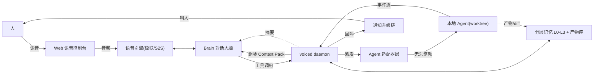
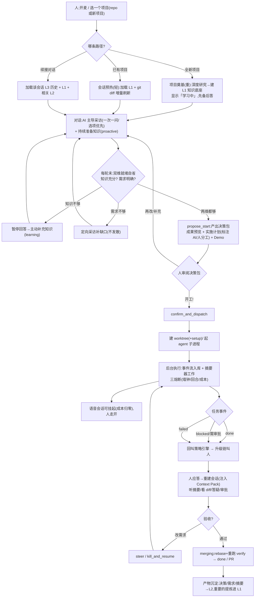
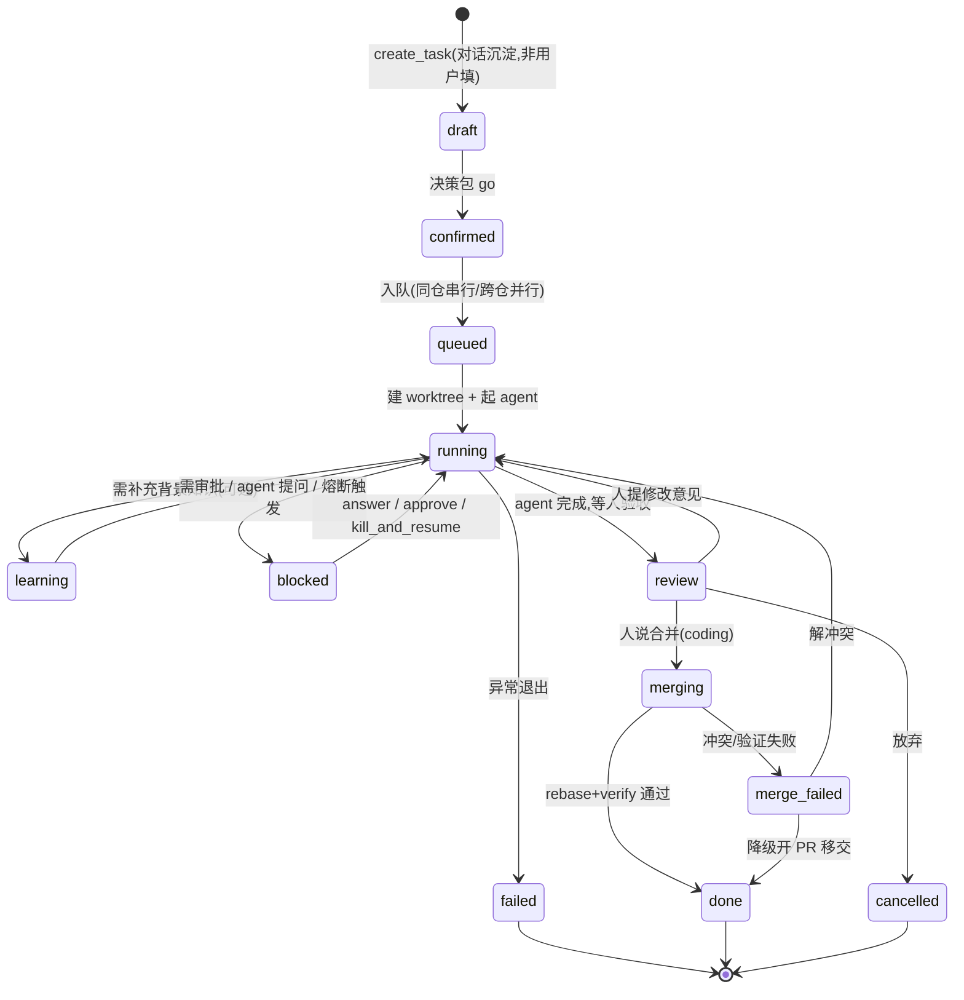
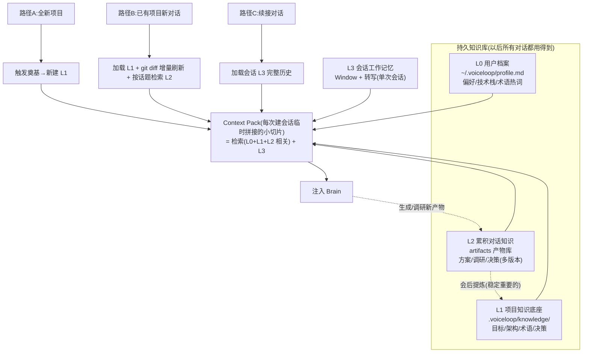
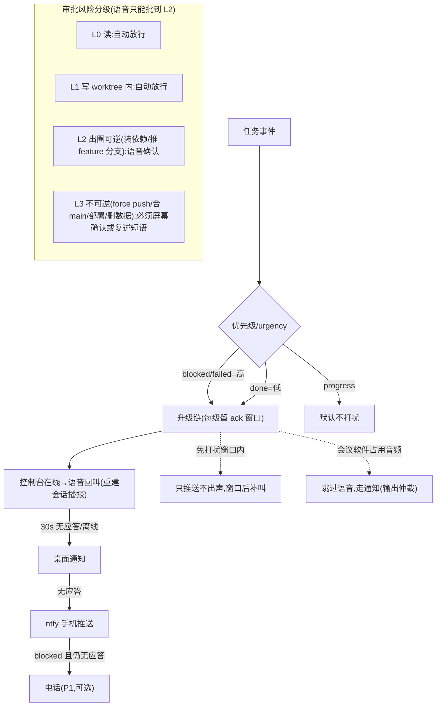
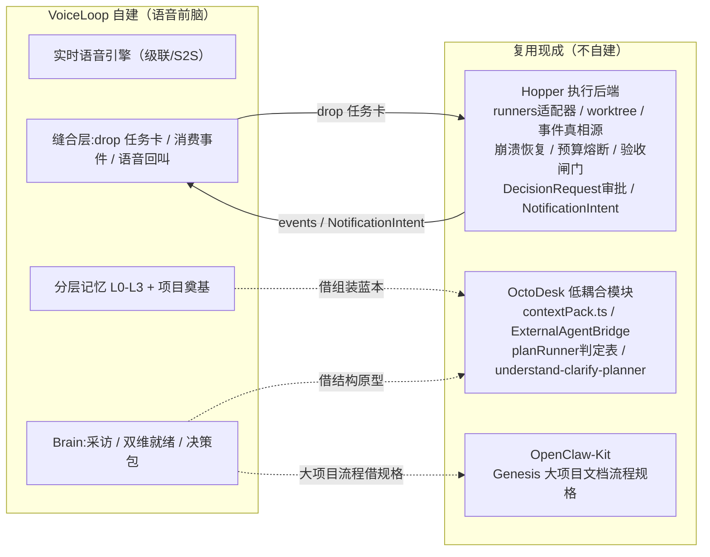

# VoiceLoop 业务流程说明(数据流 / 任务流 / 各流程)

> 目的:把我对 VoiceLoop 完整业务的理解**用文字和流程图写清楚,供你确认是否与你想的一致**。确认后我再据此画精绘 SVG。
> 基准:主方案 `voice-coding-framework.Cursor2.md` v1.12。每个流程末尾标注对应章节,便于你对照。
> **v1.13 更新(据 R13 三本地项目综合)**:下游执行层明确为**复用 Hopper 执行后端**(非自建),VoiceLoop 自建范围收缩到"语音前脑"三块能力 + 一层缝合。落地分工见 §11(此为待你确认的战略,详见 `local-projects-borrowing-assessment.md`)。
> 图:下面每节先给 mermaid 流程草图(便于结构确认),SVG 精绘版在确认后单独产出(`business-flows.html`)。

---

## 0. 一句话业务全景

**你只管对着它说话**(不下指令,聊到 AI 自己判断"知识够了+需求清楚了")→ AI 先把项目/领域**研究透并沉淀成持久记忆**,同时**采访式**把需求问清 → 够了它**主动给决策包**(成果预览+计划+Demo)请你拍板 → 你说"开工"→ 它**派本地 agent 后台干活**、你可以走开 → 完成/卡住它**主动叫你**→ 你验收/改 → 合并交活。全过程产生的知识与产物都**持久化、可召回续用**。

---

## 1. 系统角色与组件(数据流的主体)

| 角色/组件 | 职责 | 对应章节 |
|---|---|---|
| **人(owner)** | 说话、审阅决策包、验收、批高危操作 | §1 |
| **Web 语音控制台** | 麦克风/扬声器(浏览器 AEC)、屏幕看 Demo/diff、审批卡片 | §3.2 |
| **语音引擎** | 级联(默认:流式 ASR+文本 LLM+流式 TTS)或 S2S(增强) | §2.1 |
| **Brain(对话大脑)** | 采访/回答/口播 + 调工具;两类行为:准备知识 / 回答问题 | §4.2 |
| **voiced daemon** | 常驻后台:执行工具、编排任务、跑适配器、发回叫、管记忆/产物 | §3.2 |
| **Context 预研器** | 项目奠基(一次性重)+ 会话预热(每次轻) | §4.1/§4.19 |
| **Agent 适配器层** | 无头驱动 Claude Code/Codex/Cursor,两级集成 | §4.4 |
| **本地 Agent(子进程)** | 在独立 git worktree 里执行(coding 类型);其它类型对应执行器 | §4.8/§4.16 |
| **分层记忆 L0-L3 + 产物库** | 持久知识库 + 每次拼接的 Context Pack | §4.18/§4.19 |
| **回叫策略引擎** | 事件→通知升级链(语音→桌面→ntfy→电话)+ 免打扰 + 输出仲裁 | §4.6 |

---

## 2. 数据流总览(谁把什么给谁)



**要点**:① Brain 无状态、无直接执行权——所有副作用在 daemon;工具返回值是 Brain 的全部世界观(语音层可随时死掉重建)。② agent 原始事件流**永不**直接进 Brain,先经摘要器压成口播摘要。③ 记忆是核心枢纽:daemon 读它组装 Context Pack、写它沉淀新产物。④ **(v1.13)"Agent 适配器层 + 本地 Agent"这一段整体复用 Hopper 执行后端**(runners/worktree/事件真相源/崩溃恢复/预算熔断/验收);daemon 在此退化为"缝合层"——把决策包 drop 进 Hopper、消费 Hopper 事件回来做回叫。(§4.2/§4.5/§4.19 + §11)

---

## 3. 主交互闭环(任务流核心:从说话到交活)



**要点**:① 开工时机由 **AI 提议**(不是人下指令),但保留人的**轻量确认**(看 Demo 判断,审阅式而非规约式)。② 派发后语音会话与开发任务**生命周期解耦**——会话挂起省钱,任务后台照跑。③ 改需求走 steer(Tier1 Claude 流式注入)或 kill_and_resume(Tier2 Codex/Cursor)。(§4.3/§4.20/§4.1/§4.19/§4.8/§4.4/§4.6)

---

## 4. 任务生命周期状态机



**要点**:① 非 coding 类型(research/marketing/…)没有 merging/verify,对应"内容评审"收尾。② `learning` 是 v1.7 升为一等的状态(准备知识时的透明等待)。③ 启动对账:daemon 重启后,状态 running 但 PID 不在的任务→标记 interrupted→resume 恢复。(§4.8/§4.16/§4.19)

---

## 5. 三条对话路径 × 分层记忆 × Context Pack 装配



**要点(这是与"ChatGPT 新窗口"的分水岭)**:**持久知识库(L0/L1/L2)≠ 每次拼接的 Context Pack**。知识库是大底座、长期沉淀;Context Pack 是每次会话临时取用的小切片。全新项目必须先奠基建 L1,否则等于零上下文开聊。知识库随对话生长(写 L2)并定期提炼(进 L1)。(§4.19)

---

## 6. 回叫升级链 + 审批风险分级



**要点**:① 拦截≠叫人——危险动作先让 agent 换路,反复撞墙才升级人(降回叫频率)。② 审批中断点应落盘可恢复(daemon 重启不丢),四动作 accept/edit/respond/ignore(语音只给 accept/ignore)。③ 电话层可 DTMF 闭环确认。(§4.6/§4.7,含 §15 缺口 G2)

---

## 7. 关键数据实体(持久化)

```
projects(id, title, type, status, repo?, ...)          # coding/research/marketing/planning/general
tasks(id, project_id, title, spec_json, status, agent, worktree, ...)   # 任务卡=AI 沉淀的产物
agent_runs(id, task_id, adapter, native_session_id, cost_usd, ...)      # native_session_id=恢复钥匙
events(id, task_id, ts, type, payload_json, spoken)     # 原始事件流(不直接进 Brain)
questions / approvals                                    # 采访提问 / 审批记录(应可恢复)
artifacts(id, project_id, type, source, version, tags, body_or_path, ...)  # L2 产物库=统一记忆层
知识底座文件:.voiceloop/knowledge/{project,architecture,glossary,decisions}.md + index.json  # L1
~/.voiceloop/profile.md  # L0
```

**要点**:任务卡/spec 是 **AI 在对话中沉淀的产物**,不是要用户填的输入(§4.2 设计哲学)。(§4.10/§4.18/§4.19)

---

## 8. 跨切面(贯穿以上所有流程)

- **对话优先于指令**(§0):全程不要求用户下指令;spec 是 AI 产物。
- **失败可见性**(§15):任何环节失败必须有真实反馈+留痕,绝不静默。
- **注意力预算**(§4.13):回叫值得打扰才叫、口播短、采访不啰嗦。
- **多引擎/多类型/多人模式**:语音引擎级联默认/S2S 增强;项目类型 5 种;多人会议旁听为 P2+ 未来模式(§2.1/§4.16/§4.21)。
- **失控防护**:worktree 隔离 + 三熔断 + verify 白名单 + 启动对账(§4.7/§4.8)。

---

## 9. 与方案 v1.12 一致性自检(review)

| 本文流程 | 对应方案章节 | 一致性 |
|---|---|---|
| §2 数据流总览 | §3.2 组件 + §4.2 Brain 无状态 + §4.5 摘要 | [ok] |
| §3 主交互闭环 | §4.1/§4.3/§4.19/§4.20/§4.8/§4.6 | [ok] |
| §4 状态机 | §4.8 状态 + §4.19 learning + §4.16 类型差异 | [ok] |
| §5 三路径×记忆 | §4.19(分层记忆/奠基/三路径/生长) | [ok] |
| §6 回叫+审批 | §4.6 回叫 + §4.7 审批分级 | [ok] |
| §7 数据实体 | §4.10 数据模型 + §4.18 产物库 | [ok] |
| §8 跨切面 | §0/§4.13/§2.1/§4.16/§4.21/§15 | [ok] |

**自检结论**:以上 7 个流程覆盖了"数据流(§2/§7)、任务流(§3/§4)、各方面流程(§5 记忆装配 / §6 回叫审批)",且逐条对得上方案 v1.12,无新增设定、无与方案冲突之处。**若你确认这份理解无误,我据此画精绘 SVG(`business-flows.html`)。**

## 10. 需要你确认/可能有歧义的点(画 SVG 前想跟你对齐)

1. **默认语音引擎**:图里按"级联默认、S2S 增强"画(v1.4 裁决)。若你想突出 S2S 我再调。
2. **主闭环的详略**:§3 这张是全流程主图,信息较多;SVG 我打算拆成"对话→就绪→决策包"和"派发→执行→回叫→验收"两段,避免一张图过挤——可否?
3. **多人会议旁听模式**:P2+ 未来模式,SVG 里我打算**淡化/标注为未来**,不进主图,可否?
4. **图的粒度**:面向"确认业务理解"用中文、偏概念;不画到 API/字段级。如需更细我再加。

---

## 11. 落地分工:语音前脑 + Hopper 执行后端(v1.13,据 R13 综合;待战略确认)

三本地项目综合(`local-projects-borrowing-assessment.md`)得出:VoiceLoop 该自建的只剩**三块独特能力 + 一层缝合**,其余下游**复用现成**(首选 Hopper)。



**落地映射(每块下游 → 复用谁)**:

| VoiceLoop 组件 | 复用 | 改造点 |
|---|---|---|
| Agent 适配器 | Hopper `src/runners/` | 加流式 stream-json + 运行中 steer/answer |
| 任务流真相源+崩溃恢复 | Hopper events.jsonl + recovery | 基本直用 |
| 预算熔断 / worktree | Hopper `src/usage/` `src/worktree/` | 直用 |
| Context Pack 装配 | OctoDesk `contextPack.ts` | 加"对话转写"源 |
| 采访→就绪→决策包 | OctoDesk understand-clarify-planner | 表单式→实时语音 |
| 审批/物化 | OctoDesk EffectIntent + Hopper DecisionRequest | 所见即所签→所闻即所签 |
| 回叫 | Hopper NotificationIntent(语音=一个 transport) | verdict→语音回叫回调位 |
| 大项目文档流程 | OpenClaw-Kit Genesis 规格 | 角色×引擎可配置 |

**边界**:这是**待你确认的战略修正**(对应主方案 §13,当时漏了 Hopper)。若确认走此路,主闭环图 3 的"派发→worktree→执行"即"drop 进 Hopper→Hopper 跑",回叫即"消费 Hopper 事件";若不走 Hopper,则回退为自建薄下游。风险:Hopper 平台化仍早(执行器 M3d 未实现,自估 10-12 周),可先按其现状 task 粒度集成。

## 12. 部署拓扑:移动沟通端 × 桌面/服务端执行(v1.13,主方案 §4.22)

owner 洞察:沟通天然移动、执行天然固定 → **前脑与后端物理跨设备分离**。三拓扑:T1 同机(P0)/ T2 手机沟通+桌面执行(P1,主形态,靠 Tailscale)/ T3 手机+服务端执行(P2)。移动端只做沟通面(语音 I/O / 看 Demo / 拍板 / 审批),重活(奠基/记忆/agent/worktree)全在执行端;两者靠安全通道 + 事件流连接,手机断连不影响后端——这是"隔夜交活"的前提。详见主方案 §4.22 与 `business-flows.html` 图 7。
